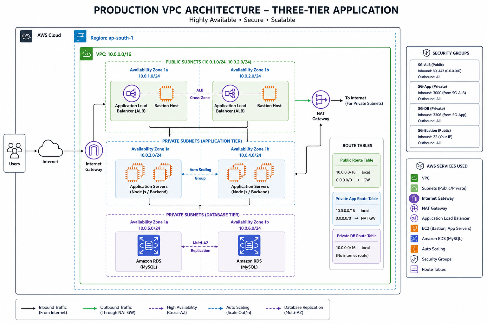
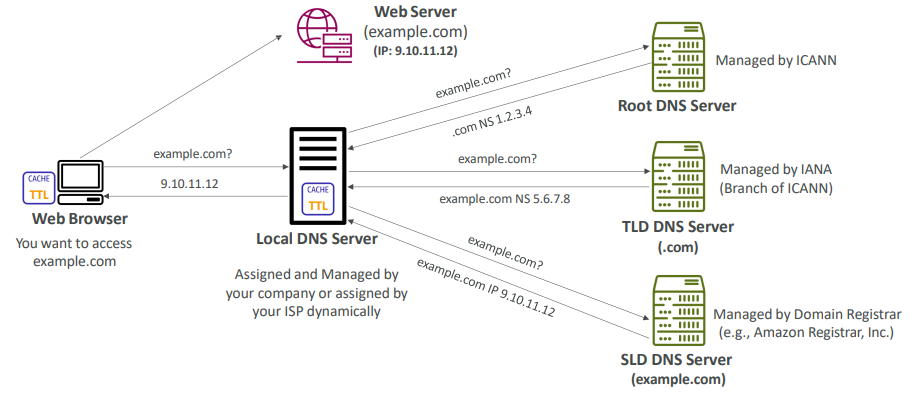
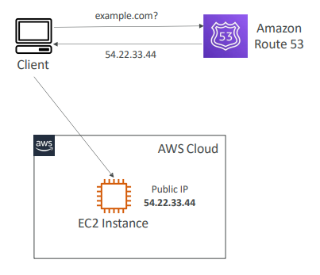
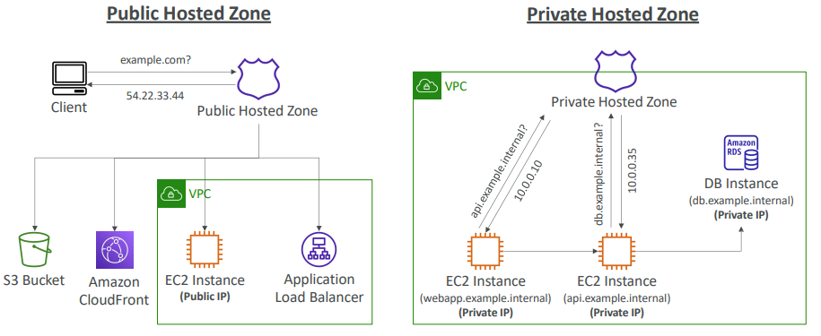
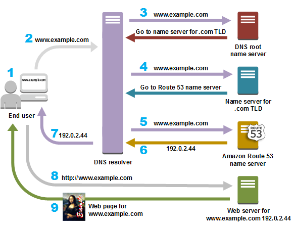
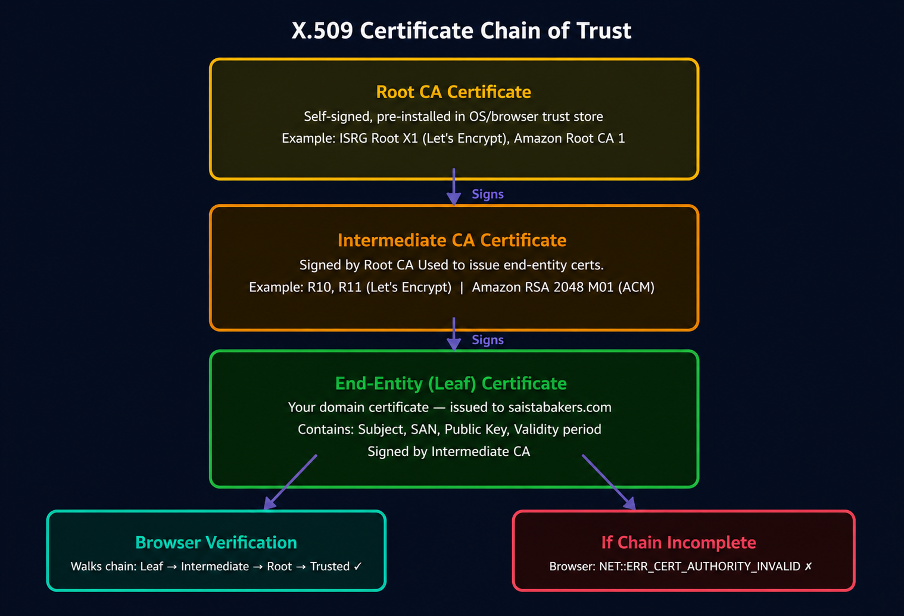
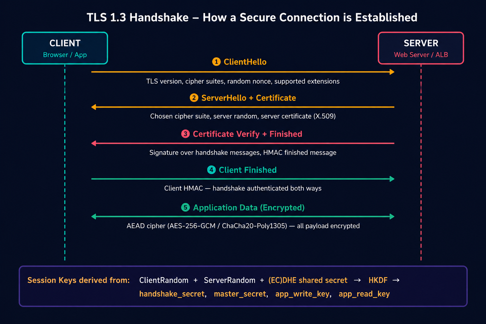
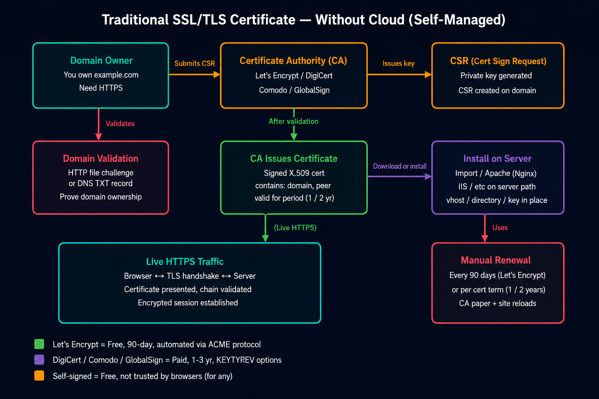
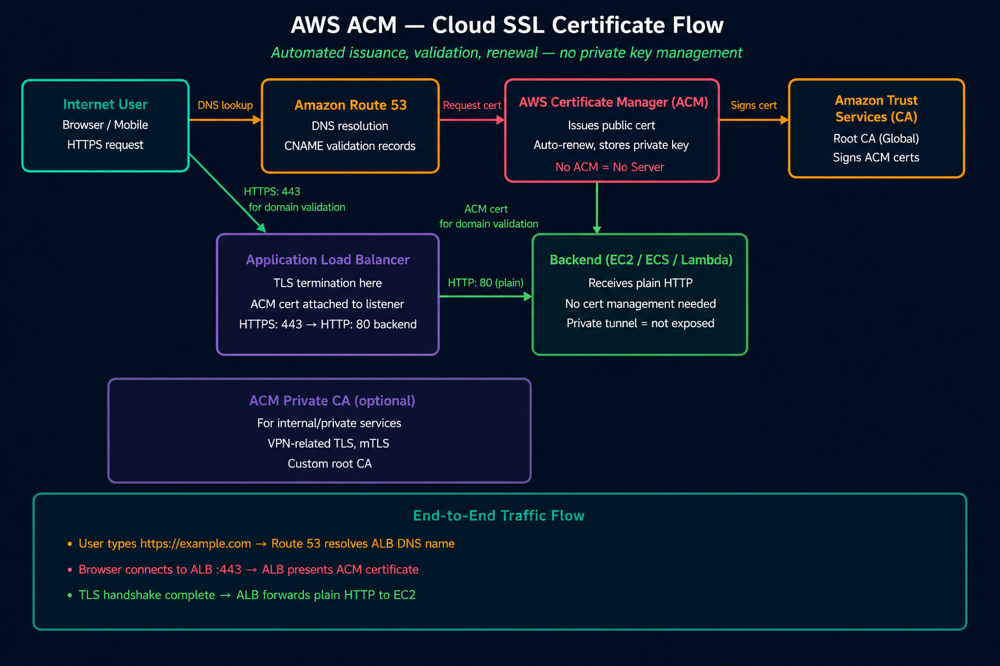
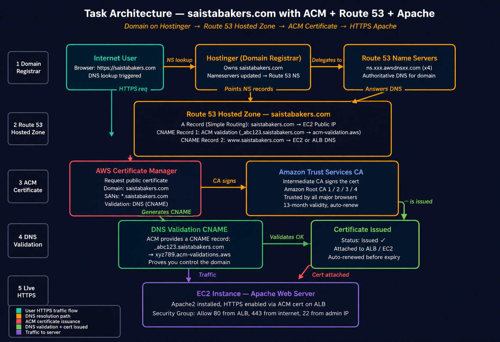

# AWS Infrastructure Guide

## Table of Contents

- [VPC & Networking](#vpc-networking)
- [EC2 Instances](#ec2-instances)
- [Auto Scaling Groups (ASG)](#auto-scaling-groups-asg)
- [Elastic Load Balancing](#elastic-load-balancing)
- [Route 53](#route-53)
- [AWS Certificate Manager (ACM)](#aws-certificate-manager-acm)

---

<a id="vpc-networking"></a>
# VPC & Networking

## AWS VPC — Complete Case Study Documentation

> **Module:** AWS Networking | **Level:** Beginner to Production  
> **Goal:** Understand VPC from scratch, then build a full production-grade three-tier architecture on AWS.

---

### Table of Contents

1. [What is a VPC?](#1-what-is-a-vpc)
2. [Public Subnet](#2-public-subnet)
3. [Private Subnet](#3-private-subnet)
4. [Internet Gateway (IGW)](#4-internet-gateway-igw)
5. [NAT Gateway](#5-nat-gateway)
6. [Bastion Host](#6-bastion-host)
7. [Route Tables](#7-route-tables)
8. [Security Groups](#8-security-groups)
9. [Task — Production Three-Tier Architecture on AWS](#9-task--production-three-tier-architecture-on-aws)

---

### 1. What is a VPC?

#### Definition

A **Virtual Private Cloud (VPC)** is your own logically isolated section of the AWS Cloud. Think of it as your **private data center inside AWS** — you control everything: IP address ranges, subnets, routing, and security.

When you sign up for AWS, you get a default VPC in every region. But for production workloads, you always create a **custom VPC** so you have full control.

#### How AWS handles it

- AWS assigns your VPC a **CIDR block** (Classless Inter-Domain Routing) — a range of private IP addresses.
- Everything inside the VPC stays **private by default** — no internet access unless you explicitly configure it.
- A VPC is **region-scoped** — it spans all Availability Zones within that region.
- You can create multiple VPCs per region (default limit: 5, can be increased).

#### Why it matters

| Without VPC | With VPC |
|---|---|
| Shared network with all AWS customers | Fully isolated private network |
| No control over IP ranges | You define your own IP scheme |
| No fine-grained routing control | Custom route tables per subnet |
| Security is harder to enforce | Layered security with SGs and NACLs |

#### CIDR Block — Understanding IP Ranges

```
VPC CIDR: 10.0.0.0/16

/16 means:
  - First 16 bits are fixed (10.0)
  - Last 16 bits are flexible
  - Total IPs: 65,536

You then divide this into smaller subnets:
  10.0.1.0/24  → 256 IPs (subnet 1)
  10.0.2.0/24  → 256 IPs (subnet 2)
  10.0.3.0/24  → 256 IPs (subnet 3)
  ... and so on
```

#### ASCII Diagram — VPC Overview

```
┌─────────────────────────────────────────────────────────┐
│                    AWS Region (ap-south-1)               │
│                                                         │
│  ┌──────────────────────────────────────────────────┐   │
│  │          Production VPC (10.0.0.0/16)            │   │
│  │                                                  │   │
│  │  ┌────────────────┐  ┌────────────────┐          │   │
│  │  │ Availability   │  │ Availability   │          │   │
│  │  │ Zone 1a        │  │ Zone 1b        │          │   │
│  │  │                │  │                │          │   │
│  │  │ 10.0.1.0/24   │  │ 10.0.2.0/24   │          │   │
│  │  │ 10.0.3.0/24   │  │ 10.0.4.0/24   │          │   │
│  │  │ 10.0.5.0/24   │  │ 10.0.6.0/24   │          │   │
│  │  └────────────────┘  └────────────────┘          │   │
│  └──────────────────────────────────────────────────┘   │
└─────────────────────────────────────────────────────────┘
```

---

### 2. Public Subnet

#### Definition

A **Public Subnet** is a subnet inside your VPC that has a direct route to the **Internet Gateway**. Resources placed here can have public IP addresses and communicate directly with the internet.

#### Characteristics

- Has a route: `0.0.0.0/0 → Internet Gateway`
- Instances can have **public IPv4 addresses** (auto-assign enabled)
- Directly reachable from the internet
- Used for resources that **need** to be internet-facing

#### What lives in a Public Subnet?

| Resource | Why Public? |
|---|---|
| Application Load Balancer (ALB) | Receives traffic from users on the internet |
| Bastion Host | Needs to be SSH-able from your laptop |
| NAT Gateway | Must reach the internet to forward private traffic |
| Web Tier (NGINX) | Serves frontend to users |

#### AWS Networking Detail

AWS reserves **5 IP addresses** in every subnet (first 4 and last 1):
- `.0` — Network address
- `.1` — VPC router
- `.2` — AWS DNS
- `.3` — Reserved for future use
- `.255` — Broadcast address

So a `/24` subnet gives you **251 usable IPs**, not 256.

#### ASCII Diagram — Public Subnet

```
                        Internet
                           │
                    ┌──────▼──────┐
                    │   Internet  │
                    │   Gateway   │
                    └──────┬──────┘
                           │
        ┌──────────────────▼───────────────────┐
        │         PUBLIC SUBNET (10.0.1.0/24)  │
        │                                      │
        │   ┌─────────────┐  ┌──────────────┐  │
        │   │ Public ALB  │  │ Bastion Host │  │
        │   │ (receives   │  │ (SSH access) │  │
        │   │  user HTTP) │  │              │  │
        │   └─────────────┘  └──────────────┘  │
        │                                      │
        │   Route: 0.0.0.0/0 → IGW             │
        └──────────────────────────────────────┘
```

---

### 3. Private Subnet

#### Definition

A **Private Subnet** is a subnet with **no direct route to the internet**. Instances here have only private IP addresses and cannot be reached from the internet directly. They can only send outbound internet traffic through a **NAT Gateway**.

#### Why use Private Subnets?

Security is the core reason. You never want your database or application servers directly exposed to the internet. If an attacker can't reach your server, they can't attack it.

#### Types of Private Subnets in a Three-Tier Architecture

| Subnet Type | Purpose | Example CIDR |
|---|---|---|
| App Private Subnet | Node.js / backend application servers | 10.0.3.0/24, 10.0.4.0/24 |
| Database Private Subnet | MySQL / RDS databases | 10.0.5.0/24, 10.0.6.0/24 |

#### AWS Networking Detail

- Private subnets use the **main route table** or a custom route table with no IGW route
- Outbound internet (for updates, package installs) goes through **NAT Gateway**
- Inbound access only allowed from within the VPC (e.g., internal ALB, Bastion Host)

#### ASCII Diagram — Private Subnet

```
        ┌─────────────────────────────────────────────┐
        │        VPC (10.0.0.0/16)                   │
        │                                             │
        │  ┌──────────────────────────────────────┐   │
        │  │  PRIVATE SUBNET (10.0.3.0/24)        │   │
        │  │                                      │   │
        │  │   ┌─────────┐     ┌─────────┐        │   │
        │  │   │ Node.js │     │ Node.js │        │   │
        │  │   │ App     │     │ App     │        │   │
        │  │   └─────────┘     └─────────┘        │   │
        │  │                                      │   │
        │  │  No public IP — No direct internet   │   │
        │  │  Route: 0.0.0.0/0 → NAT Gateway      │   │
        │  └──────────────────────────────────────┘   │
        │                                             │
        │  ┌──────────────────────────────────────┐   │
        │  │  DATABASE SUBNET (10.0.5.0/24)       │   │
        │  │                                      │   │
        │  │   ┌─────────────────────────┐        │   │
        │  │   │  MySQL DB Instance      │        │   │
        │  │   │  Private IP: 10.0.21.138│        │   │
        │  │   └─────────────────────────┘        │   │
        │  │                                      │   │
        │  │  Isolated — only App-SG can connect  │   │
        │  └──────────────────────────────────────┘   │
        └─────────────────────────────────────────────┘
```

---

### 4. Internet Gateway (IGW)

#### Definition

An **Internet Gateway (IGW)** is a horizontally scaled, redundant, and highly available VPC component that allows communication between your VPC and the internet. It serves two purposes:

1. Provides a **target in route tables** for internet-routable traffic
2. Performs **Network Address Translation (NAT)** for instances with public IPv4 addresses

#### Key Facts

- **One IGW per VPC** — you cannot attach multiple IGWs to one VPC
- **Fully managed by AWS** — no bandwidth limits, no availability concerns, no scaling needed
- **Free** — no cost to create or attach an IGW (you pay for data transfer)
- Must be **attached** to the VPC to work (created separately, then attached)

#### How Traffic Flows Through IGW

```
User Browser (203.0.113.1)
        │
        ▼
Internet Gateway
        │  (AWS translates public IP → private IP of your instance)
        ▼
Public ALB (10.0.1.50 internally, public IP assigned by AWS)
        │
        ▼
Your EC2 Instance
```

#### ASCII Diagram — IGW Role

```
    Internet (0.0.0.0/0)
          │
   ┌──────▼───────┐
   │   INTERNET   │  ← Attached to Production VPC
   │   GATEWAY    │  ← Managed, HA, no scaling needed
   │  (IGW)       │  ← Free resource
   └──────┬───────┘
          │
          │  Route Table Entry:
          │  Destination: 0.0.0.0/0
          │  Target: igw-xxxxxxxx
          ▼
   Public Subnets Only
   (10.0.1.0/24 and 10.0.2.0/24)
```

#### IGW vs NAT Gateway

| Feature | Internet Gateway | NAT Gateway |
|---|---|---|
| Direction | Inbound + Outbound | Outbound only |
| Used for | Public subnets | Private subnets |
| Cost | Free | Paid (hourly + data) |
| Public IP needed? | Yes (on instance) | No (NAT has its own EIP) |

---

### 5. NAT Gateway

#### Definition

A **NAT Gateway (Network Address Translation Gateway)** allows instances in **private subnets** to initiate outbound connections to the internet while preventing the internet from initiating connections back to those instances.

#### Why NAT Gateway?

Your private EC2 instances (app servers, database) still need internet access for:
- `apt update` — OS security patches
- `npm install` — application dependencies
- `git clone` — pulling code from GitHub
- Downloading SSL certificates

But you don't want the internet to reach them directly. NAT Gateway solves this.

#### How NAT Gateway Works

1. Private instance sends traffic to NAT Gateway
2. NAT Gateway **replaces the source IP** with its own Elastic IP (public IP)
3. Internet sees only the NAT Gateway's IP — private instance stays hidden
4. Response comes back to NAT Gateway, which forwards it to the private instance

#### Key Facts

- **Lives in a public subnet** (needs internet access itself)
- Requires an **Elastic IP** (static public IP assigned to it)
- **Managed by AWS** — highly available within an AZ
- For multi-AZ HA: deploy one NAT Gateway **per AZ**
- **Costs money** — hourly charge + per GB data processed

#### ASCII Diagram — NAT Gateway Flow

```
PRIVATE SUBNET                    PUBLIC SUBNET
┌─────────────────┐               ┌─────────────────────┐
│                 │               │                     │
│  App Instance   │──────────────▶│   NAT Gateway       │
│  10.0.3.10      │               │   EIP: 13.x.x.x     │
│  (No Public IP) │               │   Subnet: 10.0.1.x  │
│                 │               │                     │
└─────────────────┘               └────────┬────────────┘
                                           │
                                           ▼
                                     Internet Gateway
                                           │
                                           ▼
                                       Internet
                                  (npm, apt, github)

Return path: Internet → IGW → NAT Gateway → App Instance
```

#### NAT Gateway vs NAT Instance

| Feature | NAT Gateway | NAT Instance |
|---|---|---|
| Management | Fully managed by AWS | You manage the EC2 |
| Availability | Highly available in AZ | Single point of failure |
| Bandwidth | Up to 45 Gbps | Limited by instance type |
| Cost | Higher | Cheaper (EC2 cost) |
| Recommendation | Production | Learning/dev only |

---

### 6. Bastion Host

#### Definition

A **Bastion Host** (also called a Jump Server or Jump Box) is a special-purpose EC2 instance placed in a **public subnet** that acts as a secure gateway for SSH access to instances in **private subnets**.

#### The Security Problem It Solves

Your app servers and database are in private subnets — they have no public IP and cannot be SSH'd directly from the internet. But you (the developer/admin) still need to:
- Debug application issues
- Run database migrations
- Install software manually

The Bastion Host gives you a **single, controlled entry point** into your private network.

#### Security Best Practices for Bastion Host

- Allow SSH (port 22) **only from your specific IP** (not `0.0.0.0/0` in production)
- Use **key pairs** — never passwords
- Enable **CloudTrail** to log all Bastion activity
- Consider **AWS Systems Manager Session Manager** as a zero-bastion alternative
- Shut it down when not in use (to save cost and reduce attack surface)

#### How SSH Jump Works

```bash
# Step 1: SSH into Bastion Host (it's in public subnet, has public IP)
ssh -i mykey.pem ubuntu@<bastion-public-ip>

# Step 2: From Bastion, SSH into App Server (private IP only)
ssh -i mykey.pem ubuntu@10.0.3.10

# Or use SSH ProxyJump in one command:
ssh -i mykey.pem -J ubuntu@<bastion-ip> ubuntu@10.0.3.10
```

#### ASCII Diagram — Bastion Host Access

```
Your Laptop
    │
    │  SSH Port 22
    ▼
┌───────────────────────────────────────────┐
│              PUBLIC SUBNET                │
│                                           │
│   ┌─────────────────────────────────┐    │
│   │         Bastion Host            │    │
│   │   Public IP: 13.x.x.x           │    │
│   │   Security Group: Bastion-SG    │    │
│   │   Allows SSH from: 0.0.0.0/0   │    │
│   └────────────┬────────────────────┘    │
└────────────────┼──────────────────────────┘
                 │ SSH Port 22 (internal)
    ┌────────────▼────────────────────────────┐
    │           PRIVATE SUBNET                │
    │                                         │
    │   ┌──────────────┐  ┌───────────────┐   │
    │   │  App Server  │  │  DB Server    │   │
    │   │  10.0.3.10   │  │  10.0.21.138  │   │
    │   │  App-SG      │  │  DB-SG        │   │
    │   │  (allows SSH │  │  (allows SSH  │   │
    │   │  from        │  │  from         │   │
    │   │  Bastion-SG) │  │  Bastion-SG)  │   │
    │   └──────────────┘  └───────────────┘   │
    └─────────────────────────────────────────┘
```

---

### 7. Route Tables

#### Definition

A **Route Table** is a set of rules (called routes) that determines where network traffic is directed within your VPC. Every subnet must be associated with a route table, which controls the routing for that subnet.

#### How Route Tables Work

- Every VPC has a **Main Route Table** (created automatically)
- You can create **custom route tables** and associate them with specific subnets
- Each route has a **Destination** (CIDR range) and a **Target** (where to send it)
- AWS uses the **most specific route** (longest prefix match) first

#### Route Table Types in Production

##### 1. Public Route Table
```
Destination     Target
───────────     ──────────────────
10.0.0.0/16    local              ← All VPC-internal traffic stays local
0.0.0.0/0      igw-xxxxxxxx       ← All internet traffic → Internet Gateway
```
**Associations:** web-public-subnet-1a, web-public-subnet-1b

##### 2. Private App Route Table
```
Destination     Target
───────────     ──────────────────
10.0.0.0/16    local              ← VPC-internal stays local
0.0.0.0/0      nat-xxxxxxxx       ← Internet traffic → NAT Gateway
```
**Associations:** app-private-subnet-1a, app-private-subnet-1b

##### 3. Database Route Table
```
Destination     Target
───────────     ──────────────────
10.0.0.0/16    local              ← VPC-internal stays local
0.0.0.0/0      nat-xxxxxxxx       ← Internet traffic → NAT Gateway
```
**Associations:** data-private-subnet-1a, data-private-subnet-1b

#### ASCII Diagram — Route Tables

```
┌───────────────────────────────────────────────────────┐
│                   VPC: 10.0.0.0/16                    │
│                                                       │
│  ┌─────────────────┐      ┌─────────────────────┐    │
│  │  PUBLIC ROUTE   │      │  PRIVATE APP ROUTE  │    │
│  │  TABLE          │      │  TABLE              │    │
│  │                 │      │                     │    │
│  │ 10.0.0.0/16→local│    │ 10.0.0.0/16→local   │    │
│  │ 0.0.0.0/0 →IGW  │      │ 0.0.0.0/0 →NAT-GW  │    │
│  └────────┬────────┘      └──────────┬──────────┘    │
│           │                          │               │
│    ┌──────▼──────┐           ┌───────▼────────┐      │
│    │ web-public  │           │ app-private    │      │
│    │ subnet-1a   │           │ subnet-1a      │      │
│    │ subnet-1b   │           │ subnet-1b      │      │
│    └─────────────┘           └────────────────┘      │
└───────────────────────────────────────────────────────┘
```

#### The "local" Route

Every route table always has a `local` route for your VPC CIDR. This cannot be deleted and enables all subnets within the VPC to communicate with each other by default.

---

### 8. Security Groups

#### Definition

A **Security Group** acts as a virtual firewall for your EC2 instances. It controls inbound and outbound traffic at the **instance level**.

#### Key Characteristics

- **Stateful** — if you allow inbound traffic, the response is automatically allowed outbound (no need to add explicit outbound rules for responses)
- **Allow only** — you can only add ALLOW rules, not DENY rules
- **Source can be another Security Group** — this is powerful for layered security
- Applied at the **network interface** level (per instance)
- Changes take effect **immediately**

#### Security Group Chaining (The Power Feature)

Instead of allowing traffic from an IP range, you can allow traffic **from another security group**. This means only instances with that specific security group can connect — regardless of IP address.

```
Public ALB (Public-ALB-SG)
    ↓ HTTP port 80 allowed from Public-ALB-SG
Web Instances (Web-SG)
    ↓ HTTP port 80 allowed from Web-SG
Internal ALB (Internal-ALB-SG)
    ↓ TCP port 4000 allowed from Internal-ALB-SG
App Instances (App-SG)
    ↓ MySQL port 3306 allowed from App-SG
Database (DB-SG)
```

This creates a **zero-trust, least-privilege** network where each layer only accepts traffic from the layer directly above it.

---

### 9. Task — Production Three-Tier Architecture on AWS

#### Architecture Overview

This task builds a **production-grade, highly available, three-tier web application** on AWS using everything you learned above.

```
Architecture:
├── Web Tier    → NGINX (React frontend, reverse proxy)
├── App Tier    → Node.js (REST API on port 4000)
└── DB Tier     → MySQL (isolated database)
```

#### Production VPC Details

| Component | Value |
|---|---|
| VPC CIDR | 10.0.0.0/16 |
| Region | ap-south-1 (Mumbai) |
| Availability Zones | ap-south-1a, ap-south-1b |
| Public ALB DNS | ALB-Public-ALB-758543019.ap-south-1.elb.amazonaws.com |
| Internal ALB DNS | internal-Internal-ALB-1006516812.ap-south-1.elb.amazonaws.com |

#### Subnet Layout

| Subnet Name | Type | AZ | CIDR |
|---|---|---|---|
| web-public-subnet-1a | Public | ap-south-1a | 10.0.1.0/24 |
| web-public-subnet-1b | Public | ap-south-1b | 10.0.2.0/24 |
| app-private-subnet-1a | Private (App) | ap-south-1a | 10.0.3.0/24 |
| app-private-subnet-1b | Private (App) | ap-south-1b | 10.0.4.0/24 |
| data-private-subnet-1a | Private (DB) | ap-south-1a | 10.0.5.0/24 |
| data-private-subnet-1b | Private (DB) | ap-south-1b | 10.0.6.0/24 |

#### Full Architecture Diagram



*The diagram above shows the complete three-tier architecture with all networking components, security groups, load balancers, auto scaling groups, and traffic flow.*

#### Traffic Flow — How Requests Move

```
Users (Internet)
      │
      ▼ HTTP :80
Public ALB (internet-facing)
      │  ALB-Public-ALB-758543019.ap-south-1.elb.amazonaws.com
      ▼
Web-ASG Instances (NGINX in public subnets)
      │  serves React frontend from /build
      │  proxies /api/* requests
      ▼
Internal ALB (private, internal-facing)
      │  internal-Internal-ALB-1006516812.ap-south-1.elb.amazonaws.com
      ▼
App-ASG Instances (Node.js on port 4000 in private subnets)
      │
      ▼ MySQL :3306
MySQL Database (isolated in DB subnet, 10.0.21.138)
```

#### SSH Access Flow

```
Your Machine
      │ SSH :22
      ▼
Bastion Host (public subnet, Bastion-SG)
      │ SSH :22
      ▼
App Tier / DB Tier (private subnets)
```

---

### Step-by-Step Implementation

#### Step 1 — Create VPC

**AWS Console → VPC → Create VPC**

| Setting | Value |
|---|---|
| Name | Production VPC |
| CIDR Block | 10.0.0.0/16 |
| Tenancy | Default |

---

#### Step 2 — Create Internet Gateway

**VPC → Internet Gateways → Create Internet Gateway**

| Setting | Value |
|---|---|
| Name Tag | Production-IGW |

After creation: **Actions → Attach to VPC → Production VPC**

---

#### Step 3 — Create Public Subnets

**VPC → Subnets → Create Subnet → Select Production VPC**

| Subnet Name | Availability Zone | CIDR Block |
|---|---|---|
| web-public-subnet-1a | ap-south-1a | 10.0.1.0/24 |
| web-public-subnet-1b | ap-south-1b | 10.0.2.0/24 |

After creation: Select each subnet → **Actions → Edit Subnet Settings → Enable Auto-assign Public IPv4**

---

#### Step 4 — Create App Private Subnets

| Subnet Name | Availability Zone | CIDR Block |
|---|---|---|
| app-private-subnet-1a | ap-south-1a | 10.0.3.0/24 |
| app-private-subnet-1b | ap-south-1b | 10.0.4.0/24 |

> Do NOT enable auto-assign public IP for private subnets.

---

#### Step 5 — Create Database Private Subnets

| Subnet Name | Availability Zone | CIDR Block |
|---|---|---|
| data-private-subnet-1a | ap-south-1a | 10.0.5.0/24 |
| data-private-subnet-1b | ap-south-1b | 10.0.6.0/24 |

---

#### Step 6 — Create NAT Gateway

**VPC → NAT Gateways → Create NAT Gateway**

| Setting | Value |
|---|---|
| Name | Production-NAT |
| Subnet | web-public-subnet-1a (must be public!) |
| Elastic IP | Click "Allocate Elastic IP" |

> Wait for NAT Gateway status to become **Available** before proceeding (~1-2 minutes).

**Purpose:** Allows private subnet instances to access the internet for:
- `apt update` — OS updates
- `npm install` — Node.js packages
- `git clone` — pulling code
- Any outbound internet calls

---

#### Step 7 — Create Route Tables

**VPC → Route Tables → Create Route Table**

##### 1. Public Route Table

| Setting | Value |
|---|---|
| Name | Public-RT |
| VPC | Production VPC |

**Routes:**

| Destination | Target |
|---|---|
| 10.0.0.0/16 | local |
| 0.0.0.0/0 | Production-IGW |

**Subnet Associations:** web-public-subnet-1a, web-public-subnet-1b

---

##### 2. Private Route Table (App Tier)

| Setting | Value |
|---|---|
| Name | Private-App-RT |
| VPC | Production VPC |

**Routes:**

| Destination | Target |
|---|---|
| 10.0.0.0/16 | local |
| 0.0.0.0/0 | Production-NAT |

**Subnet Associations:** app-private-subnet-1a, app-private-subnet-1b

---

##### 3. Database Route Table

| Setting | Value |
|---|---|
| Name | Database-RT |
| VPC | Production VPC |

**Routes:**

| Destination | Target |
|---|---|
| 10.0.0.0/16 | local |
| 0.0.0.0/0 | Production-NAT |

**Subnet Associations:** data-private-subnet-1a, data-private-subnet-1b

---

#### Step 8 — Create Security Groups

**EC2 → Security Groups → Create Security Group**

##### 1. Bastion-SG — Used by Bastion Host

| Type | Protocol | Port | Source |
|---|---|---|---|
| SSH | TCP | 22 | 0.0.0.0/0 |

---

##### 2. Public-ALB-SG — Used by Public ALB

| Type | Protocol | Port | Source |
|---|---|---|---|
| HTTP | TCP | 80 | 0.0.0.0/0 |

---

##### 3. Web-SG — Used by Web Tier EC2 Instances

| Type | Protocol | Port | Source |
|---|---|---|---|
| HTTP | TCP | 80 | Public-ALB-SG |
| SSH | TCP | 22 | Bastion-SG |

---

##### 4. Internal-ALB-SG — Used by Internal ALB

| Type | Protocol | Port | Source |
|---|---|---|---|
| HTTP | TCP | 80 | Web-SG |

---

##### 5. App-SG — Used by App Tier Instances

| Type | Protocol | Port | Source |
|---|---|---|---|
| Custom TCP | TCP | 4000 | Internal-ALB-SG |
| SSH | TCP | 22 | Bastion-SG |

---

##### 6. DB-SG — Used by Database Instance

| Type | Protocol | Port | Source |
|---|---|---|---|
| MySQL/Aurora | TCP | 3306 | App-SG |
| SSH | TCP | 22 | Bastion-SG |

##### Security Group Reference Map

```
Bastion Host    ──uses──▶  Bastion-SG
Public ALB      ──uses──▶  Public-ALB-SG
Web Instances   ──uses──▶  Web-SG
Internal ALB    ──uses──▶  Internal-ALB-SG
App Instances   ──uses──▶  App-SG
Database        ──uses──▶  DB-SG
```

---

#### Step 9 — Create Bastion Host

**EC2 → Launch Instance**

| Setting | Value |
|---|---|
| Name | Bastion Host |
| AMI | Ubuntu Server 22.04 LTS |
| Subnet | web-public-subnet-1a |
| Security Group | Bastion-SG |
| Auto-assign Public IP | Enabled |

**Purpose:** SSH gateway to reach App Tier and Database Tier instances that are in private subnets.

---

#### Step 10 — Create Internal ALB

**EC2 → Load Balancers → Create Load Balancer → Application Load Balancer**

| Setting | Value |
|---|---|
| Name | Internal-ALB |
| Scheme | Internal |
| Type | Application Load Balancer |
| Subnets | app-private-subnet-1a, app-private-subnet-1b |
| Security Group | Internal-ALB-SG |

---

#### Step 11 — Create App Target Group

**EC2 → Target Groups → Create Target Group**

| Setting | Value |
|---|---|
| Name | App-TG |
| Protocol | HTTP |
| Port | 4000 |
| Target Type | Instance |
| Health Check Protocol | HTTP |
| Health Check Path | /health |

---

#### Step 12 — Launch Database EC2 Instance

**EC2 → Launch Instance**

| Setting | Value |
|---|---|
| AMI | Ubuntu Server 22.04 LTS |
| Subnet | data-private-subnet-1a |
| Security Group | DB-SG |
| Private IP | Assigned by AWS (noted as 10.0.21.138) |

---

#### Step 13 — Install and Configure MySQL

SSH into the DB instance via Bastion Host, then run:

```bash
# Update system
sudo apt update && sudo apt upgrade -y

# Install MySQL
sudo apt install mysql-server -y

# Secure MySQL and create database
sudo mysql
```

Inside MySQL prompt:

```sql
CREATE DATABASE webappdb;

CREATE USER 'appuser'@'%' IDENTIFIED BY 'YourStrongPassword123!';

GRANT ALL PRIVILEGES ON webappdb.* TO 'appuser'@'%';

FLUSH PRIVILEGES;

EXIT;
```

Allow remote connections:

```bash
# Edit MySQL config
sudo nano /etc/mysql/mysql.conf.d/mysqld.cnf

# Change this line:
bind-address = 127.0.0.1

# To this:
bind-address = 0.0.0.0
```

Restart and enable MySQL:

```bash
sudo systemctl restart mysql
sudo systemctl enable mysql
```

---

#### Step 14 — Launch App Tier Testing Instance

**EC2 → Launch Instance**

| Setting | Value |
|---|---|
| AMI | Ubuntu Server 22.04 LTS |
| Subnet | app-private-subnet-1a |
| Security Group | App-SG |

---

#### Step 15 — Install Node.js and PM2

SSH into App instance via Bastion, then:

```bash
# Update system
sudo apt update && sudo apt upgrade -y

# Install Node.js 16
curl -fsSL https://deb.nodesource.com/setup_16.x | sudo -E bash -
sudo apt install -y nodejs git

# Install PM2 (process manager for Node.js)
sudo npm install -g pm2
```

> **PM2** keeps your Node.js app running in the background and auto-restarts it if it crashes.

---

#### Step 16 — Clone Project Repository

```bash
git clone https://github.com/Asadkhanrtx/aws-three-tier-web-architecture-workshop.git
```

---

#### Step 17 — Configure Database Connection

```bash
nano aws-three-tier-web-architecture-workshop/application-code/app-tier/DbConfig.js
```

```javascript
module.exports = Object.freeze({
    DB_HOST     : '10.0.21.138',
    DB_USER     : 'appuser',
    DB_PWD      : 'YourStrongPassword123!',
    DB_DATABASE : 'webappdb'
});
```

---

#### Step 18 — Start App Tier

```bash
cd aws-three-tier-web-architecture-workshop/application-code/app-tier

# Install dependencies
npm install

# Start app with PM2
pm2 start index.js --name app-tier

# Save PM2 process list (survives reboots)
pm2 save
```

Verify the app is running:

```bash
curl http://localhost:4000/health
```

Expected response:
```
"This is the health check"
```

---

#### Step 19 — Register App Instance to App-TG

1. Go to **EC2 → Target Groups → App-TG**
2. Click **Register Targets**
3. Select the App Testing Instance
4. Click **Include as pending below** → **Register pending targets**
5. Wait for health check status to show **Healthy**

---

#### Step 20 — Create Public ALB

**EC2 → Load Balancers → Create Load Balancer → Application Load Balancer**

| Setting | Value |
|---|---|
| Name | Public-ALB |
| Scheme | Internet-facing |
| Subnets | web-public-subnet-1a, web-public-subnet-1b |
| Security Group | Public-ALB-SG |
| Listener | HTTP :80 |

---

#### Step 21 — Create Web Target Group

**EC2 → Target Groups → Create Target Group**

| Setting | Value |
|---|---|
| Name | Web-TG |
| Protocol | HTTP |
| Port | 80 |
| Target Type | Instance |
| Health Check Protocol | HTTP |
| Health Check Path | / |

---

#### Step 22 — Launch Web Tier Testing Instance

**EC2 → Launch Instance**

| Setting | Value |
|---|---|
| AMI | Ubuntu Server 22.04 LTS |
| Subnet | web-public-subnet-1a |
| Security Group | Web-SG |
| Auto-assign Public IP | Enabled |

---

#### Step 23 — Install NGINX and Node.js

SSH directly into the web tier instance (it has a public IP):

```bash
# Update system
sudo apt update && sudo apt upgrade -y

# Install Node.js 16
curl -fsSL https://deb.nodesource.com/setup_16.x | sudo -E bash -

# Install Node.js, NGINX, and Git
sudo apt install nodejs nginx git -y
```

Clone the repository:

```bash
git clone https://github.com/Asadkhanrtx/aws-three-tier-web-architecture-workshop.git
```

---

#### Step 24 — Build React Application

```bash
cd aws-three-tier-web-architecture-workshop/application-code/web-tier

# Install dependencies
npm install

# Build the production bundle
npm run build
```

This creates a `/build` folder containing the compiled React app ready to be served by NGINX.

---

#### Step 25 — Configure NGINX

```bash
sudo nano /etc/nginx/sites-available/default
```

Replace the entire file content with:

```nginx
server {
    listen 80 default_server;
    listen [::]:80 default_server;

    # Health check endpoint
    location /health {
        default_type text/html;
        return 200 "<!DOCTYPE html><p>Web Tier Health Check</p>\n";
    }

    # Serve React frontend
    location / {
        root /home/ubuntu/aws-three-tier-web-architecture-workshop/application-code/web-tier/build;
        index index.html index.htm;
        try_files $uri /index.html;
    }

    # Reverse proxy: forward /api/ requests to Internal ALB → App Tier
    location /api/ {
        proxy_pass http://internal-Internal-ALB-1006516812.ap-south-1.elb.amazonaws.com;
    }
}
```

##### How NGINX Connects Web and App Tiers

```
Browser request: GET /api/health
      │
      ▼
NGINX on Web Instance
      │  location /api/ matches
      ▼
proxy_pass → Internal ALB DNS
      │  internal-Internal-ALB-1006516812.ap-south-1.elb.amazonaws.com
      ▼
Internal ALB routes to App-TG
      │
      ▼
Node.js App Instance :4000
      │
      ▼
Response flows back through the same path
```

---

#### Step 26 — Restart NGINX

```bash
# Test configuration for syntax errors
sudo nginx -t

# Restart NGINX
sudo systemctl restart nginx

# Enable NGINX to start on boot
sudo systemctl enable nginx
```

---

#### Step 27 — Register Web Tier to Web-TG

1. Go to **EC2 → Target Groups → Web-TG**
2. Click **Register Targets**
3. Select the Web Tier Testing Instance
4. Register and wait for status: **Healthy**

---

#### Step 28 — Final Testing

**Frontend Access:**
```
http://ALB-Public-ALB-758543019.ap-south-1.elb.amazonaws.com
```

**Backend Health Check (from Web instance):**
```bash
curl http://localhost/api/health
```

Expected:
```
"This is the health check"
```

**Database Connectivity:** Use the DB Demo Page in the React app to verify end-to-end database read/write.

---

#### Step 29 — Create AMIs

Create Amazon Machine Images (AMIs) from your tested instances so Auto Scaling can launch identical copies.

**EC2 → Instances → Select Instance → Actions → Image and Templates → Create Image**

| Instance | AMI Name | Option |
|---|---|---|
| Web Tier Instance | ubuntu-web-tier-ami-v1 | Enable "Reboot instance" |
| App Tier Instance | ubuntu-app-tier-ami-v1 | Enable "Reboot instance" |

> Enabling reboot ensures a consistent filesystem state in the AMI.

---

#### Step 30 — Create Launch Templates

**EC2 → Launch Templates → Create Launch Template**

##### 1. Web Launch Template (Web-LT)

| Setting | Value |
|---|---|
| Name | Web-LT |
| AMI | ubuntu-web-tier-ami-v1 |
| Security Group | Web-SG |

##### 2. App Launch Template (App-LT)

| Setting | Value |
|---|---|
| Name | App-LT |
| AMI | ubuntu-app-tier-ami-v1 |
| Security Group | App-SG |

---

#### Step 31 — Create Auto Scaling Groups

**EC2 → Auto Scaling Groups → Create Auto Scaling Group**

##### Web-ASG

| Setting | Value |
|---|---|
| Name | Web-ASG |
| Launch Template | Web-LT |
| Subnets | web-public-subnet-1a, web-public-subnet-1b |
| Target Group | Web-TG |
| Desired Capacity | 2 |
| Minimum Capacity | 2 |
| Maximum Capacity | 4 |

##### App-ASG

| Setting | Value |
|---|---|
| Name | App-ASG |
| Launch Template | App-LT |
| Subnets | app-private-subnet-1a, app-private-subnet-1b |
| Target Group | App-TG |
| Desired Capacity | 2 |
| Minimum Capacity | 2 |
| Maximum Capacity | 4 |

---

### Final Architecture Summary

#### Complete Traffic Flow Diagram

```
                    Users (Internet)
                          │
                    HTTP :80
                          │
              ┌───────────▼───────────┐
              │       Public ALB      │
              │  (Internet-facing)    │
              │  Public-ALB-SG        │
              └───────────┬───────────┘
                          │
            ┌─────────────▼─────────────┐
            │         Web-ASG           │
            │  ┌─────────┐ ┌─────────┐  │
            │  │ NGINX   │ │ NGINX   │  │
            │  │ 1a      │ │ 1b      │  │
            │  └─────────┘ └─────────┘  │
            │  Web-SG, Public Subnets   │
            └─────────────┬─────────────┘
                          │ /api/* proxied
              ┌───────────▼───────────┐
              │      Internal ALB     │
              │  (Internal-facing)    │
              │  Internal-ALB-SG      │
              └───────────┬───────────┘
                          │
            ┌─────────────▼─────────────┐
            │         App-ASG           │
            │  ┌─────────┐ ┌─────────┐  │
            │  │ Node.js │ │ Node.js │  │
            │  │ :4000   │ │ :4000   │  │
            │  └─────────┘ └─────────┘  │
            │  App-SG, Private Subnets  │
            └─────────────┬─────────────┘
                          │ MySQL :3306
              ┌───────────▼───────────┐
              │    MySQL Database      │
              │  IP: 10.0.21.138       │
              │  DB-SG                │
              │  DB Private Subnet    │
              └───────────────────────┘
```

#### SSH Access Diagram

```
Your Laptop
     │ SSH :22
     ▼
Bastion Host (Public Subnet)
     │ SSH :22 (via Bastion-SG)
     ├──────────▶ App Instances (App-SG allows Bastion-SG)
     └──────────▶ DB Instance   (DB-SG allows Bastion-SG)
```

#### Auto Scaling Group Summary

```
                  Target Group Flow
                        │
                   Web Tier
                  Traffic Flow
                        │
                  ┌─────▼─────┐
                  │ Web-ASG   │──── Launch Template: Web-LT
                  │           │     AMI: web-tier-ami-v1
                  │ Desired:2 │     SG: Web-SG
                  │ Min:2     │     Subnets: public-1a, 1b
                  │ Max:4     │     Target: Web-TG
                  └─────┬─────┘
                        │
                  Internal ALB
                        │
                  ┌─────▼─────┐
                  │ App-ASG   │──── Launch Template: App-LT
                  │           │     AMI: app-tier-ami-v1
                  │ Desired:2 │     SG: App-SG
                  │ Min:2     │     Subnets: private-1a, 1b
                  │ Max:4     │     Target: App-TG
                  └───────────┘
```

---

### Production Benefits of This Architecture

| Benefit | How Achieved |
|---|---|
| **High Availability** | Multi-AZ deployment (1a + 1b for every tier) |
| **Fault Tolerance** | Auto Scaling replaces failed instances automatically |
| **Security** | Private backend — app and DB never exposed to internet |
| **Scalability** | ASG scales from 2 to 4 instances based on load |
| **Secure SSH Access** | Single controlled entry point via Bastion Host |
| **Reverse Proxy** | NGINX separates frontend concerns from backend routing |
| **Database Isolation** | DB in its own subnet, only App-SG can reach port 3306 |
| **Load Distribution** | Two ALBs distribute load at both web and app tiers |
| **Enterprise Networking** | Proper CIDR planning with room to grow (10.0.0.0/16) |
| **Zero Internet Exposure for DB** | No route to IGW from DB subnet — outbound via NAT only |

---

*Documentation prepared for AWS Networking Case Study — VPC Module*

<br>

<a id="ec2-instances"></a>
# EC2 Instances

**AWS Case Study**

**Introduction:**

Amazon Web Services (AWS) is the world's most comprehensive and broadly adopted cloud platform, offering over 200 fully featured services from data centers globally. This case study focuses on the fundamental building blocks that every AWS practitioner must understand before working with any cloud infrastructure.

The services covered in this document form the foundation of virtually every AWS architecture. Whether you are hosting a simple website, building a multi-tier application, or designing a highly available enterprise system, these components are always involved.

Goal: By the end of this case study, you will be able to launch and configure EC2 instances, apply security rules, create machine images, manage persistent storage, take backups using snapshots, and understand how networking interfaces and IPs work in AWS.

**1\. EC2 – Elastic Compute Cloud:**

**1.1 What is EC2?**

Amazon EC2 (Elastic Compute Cloud) is a web service that provides resizable compute capacity in the cloud. Think of it as renting a virtual computer (server) from AWS. You have full control over the operating system, installed software, networking configuration, and storage — just like a physical server, but hosted in AWS data centers.EC2 eliminates the upfront cost of hardware procurement. Instead of buying and maintaining physical servers, you pay only for the compute capacity you actually use, with the flexibility to scale up or down at any time.

**1.2 Key Concepts and Components:**

**Instance Types:**

AWS offers hundreds of instance types optimized for different use cases.

o   t2.micro / t3.micro — Free tier eligible, general purpose (web servers, dev/test)

o   m5.large — Balanced compute, memory, and networking (application servers)

o   c5.xlarge — Compute optimized (high-performance computing, gaming)

o   r5.large — Memory optimized (in-memory databases, big data analytics)

o   p3.xlarge — GPU instances (machine learning, scientific computing)

**Instance States:**

| **State** | **Description** | **Billing?** |
| --- | --- | --- |
| Pending | Instance is being launched and starting up | No |
| Running | Instance is fully operational and accessible | Yes |
| Stopping | Instance is in the process of being stopped | No |
| Stopped | Instance is shut down — EBS data is retained | EBS only |
| Terminated | Instance is permanently deleted — cannot recover | No |

**1.3 Step-by-Step: Launch an EC2 Instance**

-   Log in to AWS Management Console → Navigate to EC2 Dashboard
-   Click 'Launch Instance' (orange button, top right)
-   Enter a Name for your instance (e.g., 'MyWebServer')
-   Choose an AMI → Select 'Amazon Linux 2023 AMI' (Free Tier Eligible)
-   Choose Instance Type → Select 't2.micro' (Free Tier Eligible)
-   Key Pair → Click 'Create new key pair' → Name it 'mykey' → Download the .pem file (keep it safe!)
-   Network Settings → Select your VPC and Subnet (use default if new)
-   Security Group → Select 'Create security group' → Enable: SSH (22), HTTP (80), HTTPS (443)
-   Configure Storage → Leave default 8GB gp3 root volume OR increase as needed
-   Review summary on the right panel → Click 'Launch Instance'
-   Wait 1–2 minutes → Instance state changes from 'Pending' to 'Running'
-   Connect via SSH: ssh -i mykey.pem ec2-user@<your-public-ip>

**2\. Security Groups:**

**2.1 What is Security Group?**

A Security Group acts as a virtual firewall for your EC2 instances. It controls both inbound (incoming) and outbound (outgoing) traffic at the instance level. Every EC2 instance must have at least one security group attached to it.

Security groups are stateful — if you allow inbound traffic on a port, the response traffic is automatically allowed outbound, regardless of outbound rules. This is different from Network ACLs, which are stateless.

**2.2 How Security Groups work**

o   Security groups work on an allow-only model — you can only add ALLOW rules, not DENY rules.

o   All inbound traffic is DENIED by default unless explicitly allowed.

o   All outbound traffic is ALLOWED by default.

o   You can assign multiple security groups to a single EC2 instance.

o   Changes to security group rules take effect immediately — no restart required.

o   You can reference other security groups as the source, not just IP ranges.

**2.3 Inbound and Outbound Rules**

| **Field** | **Description** | **Example** |
| --- | --- | --- |
| Type | Protocol type (predefined or custom) | SSH, HTTP, HTTPS, Custom TCP |
| Protocol | Network protocol | TCP, UDP, ICMP |
| Port Range | Port number(s) to allow | 22, 80, 443, 3306, 0-65535 |
| Source (Inbound) | Who can send traffic to this port | 0.0.0.0/0, My IP, Another SG |
| Destination (Outbound) | Where traffic can go from this instance | 0.0.0.0/0 (all internet) |
| Description | Optional label for the rule | Allow web traffic from anywhere |

**2.4 Step-by-Step: Create a Security Group**

·         Go to EC2 Dashboard → Click 'Security Groups' in the left sidebar under 'Network & Security'

·         Click 'Create security group' (orange button)

·         Enter Security group name: 'WebServer-SG'

·         Enter Description: 'Security group for web server — allow HTTP, HTTPS, SSH'

·         Select your VPC from the dropdown

·         Under Inbound rules → Click 'Add rule': Type=SSH, Protocol=TCP, Port=22, Source=My IP

·         Click 'Add rule' again: Type=HTTP, Protocol=TCP, Port=80, Source=0.0.0.0/0

·         Click 'Add rule' again: Type=HTTPS, Protocol=TCP, Port=443, Source=0.0.0.0/0

·         Outbound rules → Leave default (All traffic, 0.0.0.0/0) to allow all outbound

·         Click 'Create security group'

·         To attach to an existing instance: EC2 → Instances → Select instance → Actions → Security → Change security groups → Add WebServer-SG → Save

**3\. AMI – Amazon Machine Image**

**3.1 What is an AMI?**

An Amazon Machine Image (AMI) is a pre-configured template that contains the software configuration (operating system, application server, applications) required to launch an EC2 instance. Think of an AMI as a master copy or golden image from which you can create unlimited identical instances.

Every EC2 instance is launched from an AMI. AWS provides thousands of public AMIs, and you can also create your own custom AMIs from your configured instances.

**3.2 What does an AMI contain?**

o   Root volume snapshot — the operating system and all installed software

o   Launch permissions — which AWS accounts can use the AMI

o   Block device mapping — which EBS volumes to attach on launch

o   Architecture information — x86\_64 or ARM

o   Virtualization type — HVM (Hardware Virtual Machine) or PV (Paravirtual)

**3.3 Types of AMI**

| **Type** | **Description** | **Who Provides** | **Example** |
| --- | --- | --- | --- |
| AWS Provided | Official AWS-managed base AMIs | Amazon | Amazon Linux 2023, Ubuntu 22.04, Windows Server 2022 |
| AWS Marketplace | Pre-built commercial/open-source software images | Third-party vendors | Bitnami WordPress, NGINX+, Palo Alto NGFW |
| Community AMIs | Shared publicly by other AWS users | AWS Community | Custom distros, specialized setups |
| Custom AMI | AMIs you create from your own configured instances | You | Your app stack with pre-installed software |

**3.4 AMI Regions and Copying**

AMIs are region-specific. An AMI created in ap-south-1 (Mumbai) cannot directly launch instances in us-east-1 (N. Virginia). However, you can copy an AMI to another region using the 'Copy AMI' feature. This is essential for:

o   Disaster recovery across regions

o   Deploying identical infrastructure globally

o   Sharing application setups with teams in different regions

**3.5 Sharing an AMI**

AMI can be shared in three ways:

1.      Private (default) — Only your account can use it

2.      Shared with specific accounts — Enter specific AWS Account IDs

3.      Public — Any AWS user in the world can see and launch it

**3.6 Step-by-Step: Create AMI and Share it**

·         First, ensure your EC2 instance is fully configured with all required software and settings

·         Go to EC2 Dashboard → Instances → Select your running instance

·         Click Actions → Image and Templates → Create Image

·         Enter Image name: 'MyApp-AMI-v1' (use a clear naming convention with version)

·         Enter Image description: 'Web server with Nginx and PHP 8.1 — July 2025'

·         No reboot option: Check this ONLY if you cannot afford downtime (may risk image consistency)

·         Review Block device mappings — add extra EBS volumes if needed

·         Click 'Create Image' — this process takes 3–10 minutes

·         Go to EC2 Dashboard → AMIs to monitor progress. Status changes from 'Pending' to 'Available'

·         To SHARE: Select the AMI → Actions → Edit AMI Permissions

·         Change visibility to 'Private' and enter the target AWS Account ID under 'Add AWS Account ID'

·         Click 'Add permission' → Click 'Save changes'

·         The target account can now find your shared AMI under 'Private images' in their AMI console

**4.EBS – Elastic Block Store**

**4.1 What is EBS?**

Amazon Elastic Block Store (EBS) provides persistent block storage volumes for use with Amazon EC2 instances. EBS volumes are like virtual hard disks that you attach to your EC2 instances — just like attaching an external hard drive to your laptop.

The key advantage of EBS over instance store (ephemeral storage) is persistence: EBS data survives instance stop, start, and reboot. Your data remains intact even if the EC2 instance is stopped or restarted. Only terminating the instance (with delete-on-termination enabled) removes the data.

**4.2 EBS Volume Types**

| **Type** | **Category** | **Max IOPS** | **Use Case** | **Cost** |
| --- | --- | --- | --- | --- |
| gp3 (General Purpose SSD) | SSD | 16,000 | Default for most workloads — OS, dev, test | Lowest SSD |
| gp2 (General Purpose SSD) | SSD | 16,000 | Legacy general purpose — being replaced by gp3 | Low SSD |
| io2 Block Express | SSD | 256,000 | Critical DBs — Oracle, SQL Server, SAP HANA | Highest |
| io1 (Provisioned IOPS) | SSD | 64,000 | I/O-intensive apps needing consistent performance | High |
| st1 (Throughput HDD) | HDD | 500 MB/s | Big data, Kafka, log processing, data warehouses | Low |
| sc1 (Cold HDD) | HDD | 250 MB/s | Infrequently accessed data — archives, backups | Lowest |

**4.3 Characteristics of EBS**

o   Availability Zone (AZ) locked — EBS volumes can only be attached to EC2 instances in the same AZ. To move to another AZ, create a snapshot first, then create a volume in the new AZ from that snapshot.

o   One-to-one attachment — Most EBS volumes can only be attached to ONE EC2 instance at a time (io1/io2 support Multi-Attach for specific use cases).

o   Elastic sizing — You can increase EBS volume size, change type, and adjust IOPS without downtime using 'Modify Volume'.

o   Encryption — EBS supports AES-256 encryption at rest. When you encrypt a volume, all data, snapshots, and AMIs created from it are also encrypted.

**4.4 Step-by-Step: Create and attach an EBS Volume**

-   Go to EC2 Dashboard → Elastic Block Store → Volumes → Click 'Create volume'
-   Select Volume type: 'gp3' (recommended for most use cases)
-   Set Size: '20 GiB' (adjust based on your needs)
-   CRITICAL: Set Availability Zone to MATCH your EC2 instance's AZ (e.g., ap-south-1a)
-   IOPS: Leave at 3000 (default gp3). Throughput: Leave at 125 MB/s
-   Encryption: Enable if needed — select your KMS key
-   Add a tag — Key: 'Name', Value: 'DataVolume-01'
-   Click 'Create volume' — volume status shows as 'Available'
-   Select the new volume → Click Actions → Attach volume
-   Select your EC2 instance from the dropdown → Device name: '/dev/xvdf'
-   Click 'Attach volume' — status changes to 'In-use'
-   SSH into your EC2 instance and run: sudo lsblk (to confirm disk is visible)
-   Format the disk: sudo mkfs -t ext4 /dev/xvdf

-   Create mount point: sudo mkdir /data
-   Mount it: sudo mount /dev/xvdf /data
-   Add to /etc/fstab for auto-mount on reboot: echo '/dev/xvdf /data ext4 defaults,nofail 0 2' | sudo tee -a /etc/fstab

**5.Snapshots**

**5.1  What is an EBS Snapshot?**

An EBS Snapshot is a point-in-time backup of an EBS volume, stored in Amazon S3 (managed by AWS — you don't see the S3 bucket directly). Snapshots capture the exact state of your EBS volume at the moment the snapshot was triggered.

Snapshots are incremental — the first snapshot copies all data on the volume. Subsequent snapshots only store the data that has changed since the last snapshot. This makes them efficient in terms of both time and cost.

**5.2 How Snapshots Work (Incremental Backup)**

Incremental copy in an EBS snapshot means AWS copies only the changed data blocks after the first snapshot instead of copying the entire volume again every time.

| **Snapshot** | **Data Saved** | **Size Saved** | **Description** |
| --- | --- | --- | --- |
| Snapshot 1 (First) | All 50GB of volume data | 50 GB | Full baseline copy of entire volume |
| Snapshot 2 | Only 10GB changed since Snap 1 | 10 GB | Incremental — only new/changed blocks |
| Snapshot 3 | Only 5GB changed since Snap 2 | 5 GB | Incremental — only new/changed blocks |
| Total stored | 50 + 10 + 5 = 65 GB total | 65 GB | Much less than 3 × 50GB = 150GB |

**5.3 What You Can Do With Snapshots**

o   Restore — Create a new EBS volume from a snapshot to recover lost data

o   Copy across regions — Copy a snapshot to another AWS region for DR (Disaster Recovery)

o   Share with accounts — Share snapshot with specific AWS accounts

o   Create AMI — Create an AMI from a snapshot of a root volume

o   Automate with DLM — Use Data Lifecycle Manager to create scheduled, automated snapshots

**5.4 Step-by-Step: Create EBS Snapshot and Restore**

·         Go to EC2 Dashboard → Elastic Block Store → Volumes

·         Select the EBS volume you want to back up

·         Click Actions → Create snapshot

·         Enter Description: 'Backup before upgrade — 2025-07-01'

·         Add Tag — Key: 'Name', Value: 'Pre-Upgrade-Backup-01'

·         Click 'Create snapshot' → Go to EC2 → Snapshots to monitor progress

·         Status changes from 'Pending' to 'Completed' (time depends on volume size)

·         To RESTORE: Select the snapshot → Click Actions → Create volume from snapshot

·         Set the Volume type (gp3 recommended), Size (at least as large as original), and the target AZ

·         Click 'Create volume' — new volume appears in Volumes list as 'Available'

·         To COPY to another region: Select snapshot → Actions → Copy snapshot → Select destination region

·         To SHARE: Select snapshot → Actions → Modify permissions → Add target AWS account ID

**6\. ENI, Public IP, Private IP and Elastic IP**

**6.1 What is an ENI?**

An Elastic Network Interface (ENI) is a virtual network card (NIC) that you can attach to an EC2 instance. Every EC2 instance has at least one ENI — the primary network interface — created automatically when the instance is launched.

ENIs are bound to a specific Availability Zone and can be detached from one instance and reattached to another (useful for failover scenarios). Each ENI can carry one or more private IPs, one public IP, one Elastic IP, and is associated with one or more security groups.

**6.2 The Three types of IP addresses**

| IP Type | Assigned By | Persists After Stop? | Internet Access | Cost | Primary Use |
| --- | --- | --- | --- | --- | --- |
| Private IP | AWS (from VPC CIDR range) | Yes — always retained | No (internal only) | Free | Communication within VPC between instances |
| Public IP | AWS (auto-assigned) | No — changes on stop/start | Yes | Free (while running) | Temporary internet access for dev/test |
| Elastic IP | You (from AWS pool) | Yes — you own it | Yes | Free if attached; $0.005/hr if not | Production static IP for servers, NAT, DNS |

**6.3 Private IP**

Every EC2 instance in a VPC receives a Private IP from the VPC's CIDR block (e.g., 10.0.0.0/16). This IP is used for all internal communication — instances in the same VPC talk to each other using private IPs without going over the internet.

o   Primary private IP — assigned at launch, cannot be removed while instance runs

o   Secondary private IPs — you can assign multiple private IPs to an ENI

o   Private IPs do not change when the instance is stopped and restarted

o   Private IPs are not reachable from the internet — they are internal only

o   DNS resolution: AWS provides internal DNS like ip-10-0-1-5.ec2.internal

**6.4 Public IP**

A public IP is automatically assigned to instances in a public subnet (if auto-assign is enabled). This allows the instance to communicate with the internet directly through an Internet Gateway.

**6.5 Elastic IP**

An Elastic IP (EIP) is a static, public IPv4 address that you allocate from AWS's pool and associate with your account. Unlike the auto-assigned public IP, an Elastic IP persists — even if you stop, start, or replace the underlying EC2 instance.

o   You can associate and disassociate EIPs from instances on demand

o   EIPs can be moved between instances instantly — great for failover (replace a failed server by moving the EIP to a standby)

o   AWS charges $0.005/hour for an EIP that is allocated but NOT associated with a running instance — always release unused EIPs

o   Each AWS account gets 5 EIPs per region by default (can request increase)

o   EIPs are region-specific — an EIP in ap-south-1 cannot be used in us-east-1

**6.6 Step-by-Step: Work with Elastic IP**

·         Go to EC2 Dashboard → Network & Security → Elastic IPs

·         Click 'Allocate Elastic IP address'

·         Network border group: Select your region (default is fine)

·         Click 'Allocate' — AWS assigns you a static IP like '3.110.x.x'

·         Select the new EIP → Click Actions → Associate Elastic IP address

·         Resource type: Select 'Instance'

·         Select your EC2 Instance from the dropdown

·         Private IP: Select the primary private IP of the instance

·         Click 'Associate' — the EIP is now bound to your instance

·         Verify: Go to EC2 Instances → your instance now shows the EIP as its Public IPv4

·         To RELEASE: Select EIP → Actions → Disassociate (first) → Then Actions → Release Elastic IP

·         Test: Stop and Start your EC2 instance — the Elastic IP remains the same (public IP does not change)

<br>

<a id="auto-scaling-groups-asg"></a>
# Auto Scaling Groups (ASG)

### ⚖️ Auto Scaling Groups
 
#### 💡 What is an Auto Scaling Group?
 
An **Auto Scaling Group (ASG)** is an AWS service that automatically manages the number of EC2 instances running your application. It watches your infrastructure, responds to changes in demand, and keeps your application available — all without any manual intervention.
 
Think of it like a smart staffing agency for your servers. When your website gets a traffic spike, the agency automatically hires more servers. When traffic drops at night, it lets some go. You define the rules, it handles the execution.
 
```
Traffic Pattern vs Instance Count:
 
9 AM  — Office opens, traffic spikes
        ASG detects CPU > 70%
        Launches 2 new instances ↑
 
2 PM  — Steady traffic
        ASG maintains current count
        No change needed
 
11 PM — Traffic drops overnight
        ASG detects CPU < 30%
        Terminates extra instances ↓
 
Result: You always have exactly what you need ✅
        No over-provisioning, no under-provisioning
```
 
---
 
#### 🔑 Core Concepts
 
| Term | What It Means |
|---|---|
| **Launch Template** | The blueprint ASG uses to create each new instance (AMI, type, SG, startup script) |
| **Desired Capacity** | The number of instances ASG actively tries to maintain right now |
| **Minimum Capacity** | Hard floor — ASG will never go below this count, even at zero load |
| **Maximum Capacity** | Hard ceiling — ASG will never exceed this, even at peak load |
| **Scaling Policy** | The rules that decide when to add or remove instances |
| **Health Check** | ASG continuously checks instances — unhealthy ones get replaced automatically |
 
```
Capacity Boundaries Visualized:
 
Maximum: 8  ████████ ← ASG never exceeds this
                 ↕  scaling happens here
Desired:  4  ████     ← Current target
                 ↕  scaling happens here
Minimum:  2  ██       ← ASG never drops below this
```
 
---
 
#### 📈 Scaling Policy Types
 
| Policy | How It Decides to Scale | Best For |
|---|---|---|
| **Target Tracking** | Keeps a specific metric at your target (e.g., CPU stays at 50%) | Most common — simple and effective |
| **Step Scaling** | Scales by defined amounts at different alarm thresholds | Fine-grained control over scale steps |
| **Scheduled** | Scales at specific times you define (e.g., 9 AM add 3, 10 PM remove 3) | Predictable traffic patterns |
| **Predictive** | Uses ML to forecast traffic and pre-scales ahead of time | Large applications with historical data |
 
```
Target Tracking Example:
 
Target: CPU = 50%
 
CPU hits 75% → Too high → ASG adds instances → CPU drops back toward 50%
CPU drops 20% → Too low → ASG removes instances → CPU rises back toward 50%
CPU stays 50% → Perfect → ASG does nothing
```
 
---
 
#### 🏗️ Why Use an ASG?
 
```
Without ASG:                    With ASG:
─────────────                   ──────────
Traffic spike → site crashes    Traffic spike → new instances launch ✅
Low traffic → paying for idle   Low traffic → idle instances removed ✅
Instance dies → site is down    Instance dies → replaced in minutes ✅
You manually scale at 3am       ASG scales while you sleep ✅
Fixed monthly cost              Pay only for what you use ✅
```
 
**Four Core Benefits:**
 
- 🟢 **High Availability** — Failed instances are detected and replaced automatically without any downtime
- 💰 **Cost Efficiency** — You scale in during quiet periods and scale out only when demand requires it
- 🤖 **Zero Manual Work** — Load-based decisions happen automatically based on your defined rules
- 🔀 **ALB Integration** — New instances register themselves to target groups and start receiving traffic immediately
 
---
 
#### ⚙️ ASG Scaling Flow Diagram
 
```
              ┌──────────────────────────────────────────┐
              │           Auto Scaling Group             │
              │                                          │
              │   ┌─────────────────────────────────┐   │
CPU > 70% ───►│   │  📈 Scale Out — add instances   │   │
              │   │  New instances launch from LT    │   │
              │   │  Register to ALB target group    │   │
              │   └─────────────────────────────────┘   │
              │                                          │
              │   ┌─────────────────────────────────┐   │
CPU < 30% ───►│   │  📉 Scale In — remove instances │   │
              │   │  Drain connections from ALB      │   │
              │   │  Terminate extra instances       │   │
              │   └─────────────────────────────────┘   │
              │                                          │
              │     Min: 2    Desired: 4    Max: 8       │
              └──────────────────────────────────────────┘
```
 
---
 
#### 🚀 Hands-On: Create a Launch Template
 
A Launch Template is the instruction set ASG follows every time it needs to create a new instance. Get this right and every auto-launched instance is identical and production-ready from second one.
 
##### What the Launch Template Defines
 
```
Launch Template: web-server-lt
─────────────────────────────────────────
AMI          → Which OS + software image
Instance Type → How powerful each server is
Key Pair     → SSH access credentials
Security Group → Firewall rules
Storage      → Disk size and type
User Data    → Startup script that runs on first boot
```
 
##### Step-by-Step
 
**1. Open Launch Templates**
- EC2 Dashboard → Left sidebar → **Launch Templates**
- Click **"Create launch template"**
 
**2. Template Details**
 
| Field | Value |
|---|---|
| Launch template name | web-server-lt |
| Version description | v1 — Apache web server |
| Auto Scaling guidance | ✅ Check this box |
 
**3. AMI and Instance**
 
| Field | Value |
|---|---|
| AMI | Amazon Linux 2023 (Free Tier Eligible) |
| Instance type | t3.small |
| Key pair | Select your existing key pair |
 
**4. Network Settings**
 
| Field | Value |
|---|---|
| Subnet | Do NOT specify — ASG will choose |
| Security groups | Select `web-sg` |
 
> Leaving subnet blank lets the ASG distribute instances across multiple AZs — critical for high availability.
 
**5. Storage**
 
| Field | Value |
|---|---|
| Volume type | gp3 |
| Size | 8 GiB |
 
**6. User Data Script** (Advanced Details → User Data)
 
```bash
#!/bin/bash
 
# Update system packages
apt update -y
 
# Install Apache web server
apt install -y apache2
 
# Start and enable Apache
systemctl start apache2
systemctl enable apache2
 
# Fetch instance ID from metadata service (IMDSv2)
TOKEN=$(curl -s -X PUT "http://169.254.169.254/latest/api/token" \
  -H "X-aws-ec2-metadata-token-ttl-seconds: 21600")
 
INSTANCE_ID=$(curl -s -H "X-aws-ec2-metadata-token: $TOKEN" \
  http://169.254.169.254/latest/meta-data/instance-id)
 
# Create a page that shows which instance is serving the request
echo "<h1>Response from Instance: $INSTANCE_ID</h1>" > /var/www/html/index.html
```
 
> **What this script does:** Every time ASG launches a new instance, this script runs automatically. It installs Apache, starts it, and creates a webpage showing the instance ID — so you can visually confirm load balancing is working.
 
- Click **"Create launch template"** ✅
 
---
 
#### 🚀 Hands-On: Create the Auto Scaling Group
 
##### Step-by-Step
 
**Step 1 — Name and Launch Template**
- EC2 → **Auto Scaling Groups → Create Auto Scaling Group**
 
| Field | Value |
|---|---|
| Auto Scaling group name | web-asg |
| Launch template | web-server-lt |
| Version | Latest (always uses newest template version) |
 
---
 
**Step 2 — Network Configuration**
 
| Field | Value |
|---|---|
| VPC | Your production VPC |
| Availability Zones / Subnets | `app-private-subnet-1a` AND `app-private-subnet-1b` |
 
> Always select **at least 2 subnets in different AZs**. If one AZ goes down, your instances in the other AZ keep serving traffic.
 
```
ASG Multi-AZ Layout:
 
AZ: ap-south-1a          AZ: ap-south-1b
┌──────────────┐         ┌──────────────┐
│  Instance 1  │         │  Instance 2  │
│  Instance 3  │         │  Instance 4  │
└──────────────┘         └──────────────┘
         └──────── ALB routes to both ───────┘
 
If 1a goes down → 1b still serves all traffic ✅
```
 
---
 
**Step 3 — Load Balancer Integration**
 
| Field | Value |
|---|---|
| Load balancing | Attach to an existing load balancer |
| Target group | Select `web-tg` |
| Health checks | ✅ Enable Elastic Load Balancing health checks |
| Health check grace period | 300 seconds |
 
> **Why 300 seconds grace period?** When a new instance launches, it needs time to finish the user data script, start Apache, and become ready. Without this grace period, ASG might mark it unhealthy before it's done booting and terminate it immediately.
 
---
 
**Step 4 — Capacity and Scaling**
 
| Setting | Value |
|---|---|
| Desired capacity | 2 |
| Minimum capacity | 2 |
| Maximum capacity | 6 |
| Scaling policy type | Target tracking |
| Metric | Average CPU Utilization |
| Target value | 50% |
 
```
What Target Tracking at 50% CPU means:
 
2 instances running, CPU hits 75% average:
  → CloudWatch alarm triggers
  → ASG launches 1-2 more instances
  → Load spreads across more instances
  → CPU average drops back toward 50%
 
Traffic decreases, CPU drops to 20%:
  → ASG identifies excess instances
  → Drains connections via ALB
  → Terminates extra instances
  → CPU rises back toward 50%
```
 
---
 
**Step 5 — Notifications (Optional but Recommended)**
 
- Add an SNS topic to receive email alerts when ASG launches or terminates instances
- Useful for auditing and keeping track of scaling events in production
 
---
 
**Step 6 — Review and Create**
- Review all settings
- Click **"Create Auto Scaling Group"** ✅
 
---
 
#### ✅ Verify the ASG is Working
 
**Check Scaling Activity:**
```
EC2 → Auto Scaling Groups → Select web-asg → Activity tab
 
You should see entries like:
  ✅ Launching instance i-0abc123 — Successful
  ✅ Launching instance i-0def456 — Successful
```
 
**Check Instances Were Created:**
```
EC2 → Instances
 
Filter by ASG name tag → web-asg
You should see 2 instances in Running state
Both should be in different AZs (1a and 1b)
```
 
**Check Target Group Registration:**
```
EC2 → Target Groups → web-tg → Targets tab
 
Both instances should appear as:
  Status: Healthy ✅
  Port: 80
```
 
---
 
#### 🧪 Test Auto Scaling — Simulate a CPU Spike
 
This test confirms your scaling policy actually works by artificially driving up CPU and watching ASG respond.
 
**SSH into one of the ASG instances:**
```bash
ssh -i my-keypair.pem ec2-user@INSTANCE_PUBLIC_IP
```
 
**Install the stress testing tool:**
```bash
sudo yum install -y stress
```
 
**Run CPU stress test:**
```bash
# Stress 4 CPU cores for 5 minutes
stress --cpu 4 --timeout 300
```
 
**Watch what happens in the console:**
```
1. CloudWatch picks up rising CPU metric
        ↓
2. CPU average crosses 50% threshold
        ↓
3. CloudWatch alarm state changes to ALARM
        ↓
4. ASG receives scale-out signal
        ↓
5. New instance launches from web-server-lt
        ↓
6. New instance registers to web-tg
        ↓
7. ALB starts routing traffic to it
        ↓
8. CPU load spreads → metric drops back toward 50%
```
 
Monitor in real time:
```
EC2 → Auto Scaling Groups → web-asg
→ Activity tab           ← Watch new launch events appear
→ Monitoring tab         ← Watch CPU metric graph
→ Instance management    ← Watch new instances appear
```
 
After stress test ends:
```
CPU drops → alarm clears → scale-in eventually occurs
(scale-in has a cooldown period — usually 5-15 min after CPU drops)
```
 
---

<br>

<a id="elastic-load-balancing"></a>
# Elastic Load Balancing

````md
AWS Load Balancer — Complete Notes


📌 1. What is a Load Balancer?

Definition
A Load Balancer is a networking service that distributes incoming traffic across multiple targets (EC2 instances, containers,
IP addresses, Lambda functions) in one or more Availability Zones to ensure:

- High Availability
- Fault Tolerance
- Scalability
- Reliability


🍽️ Real-World Analogy

Imagine a restaurant with multiple billing counters.

A manager stands at the entrance and sends customers to the counter with the **shortest queue**.

That manager is exactly like a Load Balancer

Result:
- No single counter gets overloaded
- Customers are served faster
- If one counter fails, others continue working


✅ Key Benefits of Load Balancers

1. High Availability: Distributes traffic across multiple Availability Zones
2. Fault Tolerance: Stops sending traffic to unhealthy servers
3. Scalability: Handles increasing traffic automatically 
4. Security: Backend servers are hidden behind the LB
5. Health Checks: Continuously monitors target health
6. SSL/TLS Termination: Offloads HTTPS encryption/decryption
7. Better Performance: Prevents server overload


🌐 AWS Elastic Load Balancing (ELB) Family

┌──────────────────────────────────────────────────────────────┐
│              AWS Elastic Load Balancing (ELB)               │
├──────────────────────┬──────────────────────┬───────────────┤
│         ALB          │         NLB          │      GLB      │
│  Application LB      │    Network LB        │  Gateway LB   │
│      Layer 7         │      Layer 4         │    Layer 3    │
│    HTTP/HTTPS        │    TCP/UDP/TLS       │   IP Traffic  │
└──────────────────────┴──────────────────────┴───────────────┘
````

> **Note:** Classic Load Balancer (CLB) is legacy/deprecated. AWS recommends ALB or NLB for new projects.

---

## 📌 2. Application Load Balancer (ALB) — Layer 7

### Definition

An **Application Load Balancer (ALB)** operates at **OSI Layer 7 (Application Layer)**.

It makes routing decisions based on the **content of HTTP/HTTPS requests** such as:

* URL Path
* Hostname
* HTTP Headers
* Query Strings
* HTTP Methods

---

## 🔹 ALB Key Characteristics

| Feature           | Description                    |
| ----------------- | ------------------------------ |
| Protocol Support  | HTTP, HTTPS, gRPC, WebSocket   |
| OSI Layer         | Layer 7 (Application Layer)    |
| Routing Type      | Content-Based Routing          |
| Targets Supported | EC2, ECS, Lambda, IP addresses |
| SSL Termination   | Supported                      |
| Sticky Sessions   | Supported                      |
| Health Checks     | HTTP/HTTPS path-based          |
| Cross-Zone LB     | Enabled by default (free)      |

---

## 🏗️ ALB Architecture

```text
                         ┌────────────────────────────────┐
                         │     Application Load Balancer  │
Client Request ───────►  │             (ALB)              │
     HTTP/HTTPS          │                                │
                         │  Listener Rules                │
                         │                                │
                         │  IF path = /api/*      ─────►  API TG
                         │  IF path = /images/*   ─────►  Image TG
                         │  IF host = mobile.*    ─────►  Mobile TG
                         │  DEFAULT               ─────►  Web TG
                         │                                │
                         └────────────────────────────────┘
```

---

## 🔧 ALB Core Components

| Component     | Description                                 |
| ------------- | ------------------------------------------- |
| Listener      | Checks incoming requests on a specific port |
| Listener Rule | Defines how traffic should be routed        |
| Target Group  | Group of backend servers/targets            |
| Health Check  | Monitors target health status               |

---

## 📌 ALB Listener Rules — One-Line Definitions

| Rule Type            | One-Line Definition                            |
| -------------------- | ---------------------------------------------- |
| Path-Based Routing   | Routes traffic based on URL path               |
| Host-Based Routing   | Routes traffic based on domain/hostname        |
| Header-Based Routing | Routes traffic based on HTTP headers           |
| Query String Routing | Routes traffic using query parameters          |
| HTTP Method Routing  | Routes based on GET, POST, PUT, DELETE methods |
| Source IP Routing    | Routes traffic based on client IP range        |

---

## 🔹 ALB Routing Examples

### 1. Path-Based Routing

```text
example.com/api/*      ───► API Servers
example.com/images/*   ───► Image Servers
example.com/admin/*    ───► Admin Servers
```

---

### 2. Host-Based Routing

```text
api.example.com        ───► API Target Group
www.example.com        ───► Web Target Group
admin.example.com      ───► Admin Target Group
```

---

### 3. Header-Based Routing

```text
Header: Device=Mobile  ───► Mobile Backend
Header: Device=Web     ───► Web Backend
```

---

### 4. Query String Routing

```text
?platform=mobile       ───► Mobile Servers
?version=v2            ───► Version 2 Backend
```

---

### 5. HTTP Method Routing

```text
GET Requests           ───► Read Servers
POST Requests          ───► Write Servers
```

---

### 6. Source IP Routing

```text
Corporate IP Range     ───► Internal Application
Public Users           ───► Public Backend
```

---

## 📌 3. Internet-Facing ALB vs Internal ALB

---

## 🌍 Internet-Facing ALB

### Definition

An **Internet-Facing ALB** has:

* Public IP addresses
* Public DNS name
* Internet accessibility

It receives traffic directly from the internet.

---

## 🏗️ Architecture

```text
                               INTERNET
                                   │
                                   ▼
                    ┌───────────────────────────┐
                    │   Internet-Facing ALB     │
                    │                           │
                    │  Public IP / Public DNS   │
                    │  Deployed in PUBLIC       │
                    │  Subnets                  │
                    └────────────┬──────────────┘
                                 │
          ┌──────────────────────┼──────────────────────┐
          ▼                      ▼                      ▼
    ┌──────────┐           ┌──────────┐           ┌──────────┐
    │  EC2-1   │           │  EC2-2   │           │  EC2-3   │
    │ Private  │           │ Private  │           │ Private  │
    └──────────┘           └──────────┘           └──────────┘

           Backend instances can remain PRIVATE
```

---

## ✅ Key Points

| Feature        | Details                     |
| -------------- | --------------------------- |
| DNS Name       | Resolves to Public IPs      |
| ALB Placement  | Public Subnets              |
| Targets        | Usually Private Subnets     |
| Security Group | Allow 80/443 from 0.0.0.0/0 |
| Accessed By    | Public Internet Users       |
| Use Cases      | Websites, Public APIs       |

---

## 🔒 Internal ALB

### Definition

An **Internal ALB** has:

* Private IP addresses only
* Private DNS name
* No internet accessibility

Used for internal communication inside a VPC.

---

## 🏗️ Architecture

```text
               ┌─────────────────────────┐
               │   Internet-Facing ALB   │
               │     Public Traffic      │
               └──────────┬──────────────┘
                          │
                          ▼
               ┌─────────────────────────┐
               │       Web Tier          │
               │     Frontend EC2        │
               └──────────┬──────────────┘
                          │
                          ▼
               ┌─────────────────────────┐
               │      Internal ALB       │
               │ Private IP / Private DNS│
               │  Deployed in PRIVATE    │
               │        Subnets          │
               └──────────┬──────────────┘
                          │
         ┌────────────────┼────────────────┐
         ▼                ▼                ▼
    ┌─────────┐      ┌─────────┐      ┌─────────┐
    │ App-1   │      │ App-2   │      │ App-3   │
    │ Private │      │ Private │      │ Private │
    └─────────┘      └─────────┘      └─────────┘
```

---

## ✅ Key Points

| Feature        | Details                        |
| -------------- | ------------------------------ |
| DNS Name       | Resolves to Private IPs        |
| Placement      | Private Subnets                |
| Access         | Only inside VPC                |
| Security Group | Allow VPC CIDR or specific SGs |
| Use Cases      | Microservices, Internal APIs   |

---

## 📊 Internet-Facing ALB vs Internal ALB

| Feature         | Internet-Facing ALB                     | Internal ALB              |
| --------------- | --------------------------------------- | ------------------------- |
| IP Type         | Public IP                               | Private IP                |
| DNS Resolution  | Public DNS                              | Private DNS               |
| Subnets         | Public                                  | Private                   |
| Accessible From | Internet + VPC                          | VPC Only                  |
| Security Group  | 0.0.0.0/0                               | VPC CIDR / Specific SG    |
| Position        | Edge Entry Point                        | Between Application Tiers |
| Example         | [www.amazon.com](http://www.amazon.com) | order-service.internal    |

---

## 📌 4. Network Load Balancer (NLB) — Layer 4

### Definition

A **Network Load Balancer (NLB)** operates at **OSI Layer 4 (Transport Layer)**.

It routes traffic based on:

* IP Address
* TCP/UDP Port

It does NOT inspect request content.

Designed for:

* Ultra High Performance
* Very Low Latency
* Millions of requests per second

---

## 🔹 NLB Key Characteristics

| Feature            | Description              |
| ------------------ | ------------------------ |
| Protocol Support   | TCP, UDP, TLS            |
| OSI Layer          | Layer 4                  |
| Routing Type       | IP + Port Based          |
| Performance        | Millions of requests/sec |
| Latency            | Microseconds             |
| Static IP          | Supported                |
| Elastic IP         | Supported                |
| Preserve Client IP | Yes                      |
| SSL Termination    | Supported                |
| Health Checks      | TCP/HTTP/HTTPS           |

---

## 🏗️ NLB Architecture

```text
                            INTERNET
                                │
                                ▼
                    ┌────────────────────┐
                    │ Network Load       │
                    │ Balancer (NLB)     │
                    │ Layer 4            │
                    │ Static IP          │
                    └─────────┬──────────┘
                              │
                              │ Routes using
                              │ IP + Port
                              │
          ┌───────────────────┼───────────────────┐
          ▼                   ▼                   ▼
     ┌─────────┐         ┌─────────┐         ┌─────────┐
     │ EC2-1   │         │ EC2-2   │         │ EC2-3   │
     │ :8080   │         │ :8080   │         │ :8080   │
     └─────────┘         └─────────┘         └─────────┘
```

---

## 📌 Why Static IP in NLB Matters

### ALB

```text
my-alb-123.elb.amazonaws.com
→ Dynamic IPs
→ IPs can change anytime
→ Use DNS name only
```

---

### NLB

```text
52.10.20.30
→ Static IP
→ Never changes
→ Can attach Elastic IP
→ Easy firewall whitelisting
```

---

## 📌 5. ALB vs NLB — Detailed Comparison

| Feature            | ALB                          | NLB                 |
| ------------------ | ---------------------------- | ------------------- |
| OSI Layer          | Layer 7                      | Layer 4             |
| Protocols          | HTTP, HTTPS, gRPC, WebSocket | TCP, UDP, TLS       |
| Routing            | Content-Based                | IP + Port           |
| Performance        | High                         | Extreme             |
| Latency            | Milliseconds                 | Microseconds        |
| Static IP          | ❌ No                         | ✅ Yes               |
| Elastic IP         | ❌ No                         | ✅ Yes               |
| Preserve Client IP | Via X-Forwarded-For          | Native              |
| SSL Termination    | Supported                    | Supported           |
| Sticky Sessions    | Cookie-Based                 | Source IP Based     |
| Lambda Support     | ✅ Yes                        | ❌ No                |
| ALB as Target      | ❌                            | ✅                   |
| Cross-Zone LB      | Enabled by Default           | Disabled by Default |
| Security Groups    | Supported                    | Not Supported       |

---

## ⚠️ Important NLB Security Note

NLB does NOT have Security Groups.

So the backend EC2 instance sees the **real client IP**.

That means:

* EC2 Security Group must allow client IP ranges directly
* Traffic does NOT appear from NLB IPs

---
## AWS Load Balancer Practice Tasks (ALB + NLB)

---

## 📌 Tasks Overview

In this the following tasks were completed:


---

## 🏗️ Architecture Used

```text
                    INTERNET
                        │
        ┌───────────────┴───────────────┐
        │                               │
        ▼                               ▼
┌─────────────────┐         ┌─────────────────┐
│       ALB       │         │       NLB       │
│ Path Routing    │         │ TCP Load Bal.   │
└────────┬────────┘         └────────┬────────┘
         │                            │
 ┌───────┴────────┐         ┌─────────┴────────┐
 ▼                ▼         ▼                  ▼
EC2-App1      EC2-App2   EC2-NLB-1        EC2-NLB-2
/app1         /app2      Red Page         Purple Page
```

---

## 📌 Task 1 — Launch EC2-App1 Instance

### Objective
Create an EC2 instance that serves the `/app1` application.

---

### Configuration

| Setting | Value |
|---|---|
| Name | EC2-App1 |
| AMI | Ubuntu |
| Instance Type | t2.micro |
| VPC | LB-Practice-VPC |
| Subnet | Public-Subnet-1 |
| Public IP | Enabled |
| Security Group | EC2-SG |

---

### User Data Script

```bash
#!/bin/bash

apt update -y
apt install apache2 -y

systemctl start apache2
systemctl enable apache2

mkdir -p /var/www/html/app1

cat <<EOF > /var/www/html/app1/index.html
<html>
<body style='background-color:#4CAF50; text-align:center;'>
<h1 style='color:white; margin-top:200px;'>
Welcome to APP 1 🟢
</h1>

<h2 style='color:white;'>
This is EC2 - App1 Server
</h2>

<h3 style='color:white;'>
Path: /app1
</h3>
</body>
</html>
EOF
```

---

## 📌 Task 2 — Launch EC2-App2 Instance

### Objective
Create another EC2 instance that serves the `/app2` application.

---

### Configuration

| Setting | Value |
|---|---|
| Name | EC2-App2 |
| AMI | Ubuntu |
| Instance Type | t2.micro |
| Subnet | Public-Subnet-2 |
| Security Group | EC2-SG |

---

### User Data Script

```bash
#!/bin/bash

apt update -y
apt install apache2 -y

systemctl start apache2
systemctl enable apache2

mkdir -p /var/www/html/app2

cat <<EOF > /var/www/html/app2/index.html
<html>
<body style='background-color:#2196F3; text-align:center;'>
<h1 style='color:white; margin-top:200px;'>
Welcome to APP 2 🔵
</h1>

<h2 style='color:white;'>
This is EC2 - App2 Server
</h2>

<h3 style='color:white;'>
Path: /app2
</h3>
</body>
</html>
EOF
```

---

## 📌 Task 3 — Launch EC2-NLB-1 Instance

### Objective
Create backend server 1 for Network Load Balancer testing.

---

### Configuration

| Setting | Value |
|---|---|
| Name | EC2-NLB-1 |
| AMI | Ubuntu |
| Subnet | Public-Subnet-1 |
| Security Group | EC2-SG |

---

### User Data Script

```bash
#!/bin/bash

apt update -y
apt install apache2 -y

systemctl start apache2
systemctl enable apache2

cat <<EOF > /var/www/html/index.html
<html>
<body style='background-color:#FF5722; text-align:center;'>

<h1 style='color:white; margin-top:200px;'>
NLB Server 1 🔴
</h1>

<h2 style='color:white;'>
This request was handled by NLB-Server-1
</h2>

</body>
</html>
EOF
```

---

## 📌 Task 4 — Launch EC2-NLB-2 Instance

### Objective
Create backend server 2 for Network Load Balancer testing.

---

### Configuration

| Setting | Value |
|---|---|
| Name | EC2-NLB-2 |
| AMI | Ubuntu |
| Subnet | Public-Subnet-2 |
| Security Group | EC2-SG |

---

### User Data Script

```bash
#!/bin/bash

apt update -y
apt install apache2 -y

systemctl start apache2
systemctl enable apache2

cat <<EOF > /var/www/html/index.html
<html>
<body style='background-color:#9C27B0; text-align:center;'>

<h1 style='color:white; margin-top:200px;'>
NLB Server 2 🟣
</h1>

<h2 style='color:white;'>
This request was handled by NLB-Server-2
</h2>

</body>
</html>
EOF
```

---

## 📌 Task 5 — Create Target Group for App1

### Objective
Create a target group for the App1 server.

---

### Configuration

| Setting | Value |
|---|---|
| Target Group Name | TG-App1 |
| Protocol | HTTP |
| Port | 80 |
| Target Type | Instances |
| Health Check Path | /app1/index.html |

---

### Registered Target

```text
EC2-App1
```

---

## 📌 Task 6 — Create Target Group for App2

### Objective
Create a target group for the App2 server.

---

### Configuration

| Setting | Value |
|---|---|
| Target Group Name | TG-App2 |
| Protocol | HTTP |
| Port | 80 |
| Target Type | Instances |
| Health Check Path | /app2/index.html |

---

### Registered Target

```text
EC2-App2
```

---

## 📌 Task 7 — Create Application Load Balancer (ALB)

### Objective
Create an Internet-Facing ALB for path-based routing.

---

### Configuration

| Setting | Value |
|---|---|
| Name | My-ALB |
| Type | Application Load Balancer |
| Scheme | Internet-Facing |
| Protocol | HTTP |
| Port | 80 |
| VPC | LB-Practice-VPC |
| Subnets | Public-Subnet-1 & Public-Subnet-2 |
| Security Group | LB-SG |

---

### Default Action

```text
Forward traffic to TG-App1
```

---

## 📌 Task 8 — Configure Path-Based Routing

### Objective
Route requests to different target groups based on URL paths.

---

## 🔹 Rule 1 — App1 Routing

| Setting | Value |
|---|---|
| Condition Type | Path |
| Path Value | /app1* |
| Action | Forward to TG-App1 |
| Priority | 1 |

---

## 🔹 Rule 2 — App2 Routing

| Setting | Value |
|---|---|
| Condition Type | Path |
| Path Value | /app2* |
| Action | Forward to TG-App2 |
| Priority | 2 |

---

## 📌 Task 9 — Test ALB Path-Based Routing

### Objective
Verify that ALB routes traffic correctly.

---

### Test URLs

```text
http://ALB-DNS/app1
```

#### Expected Result

```text
Green APP1 page 🟢
```

---

```text
http://ALB-DNS/app2
```

#### Expected Result

```text
Blue APP2 page 🔵
```

---

## 📌 Task 10 — Create Target Group for NLB

### Objective
Create target group for Network Load Balancer.

---

### Configuration

| Setting | Value |
|---|---|
| Name | TG-NLB |
| Protocol | TCP |
| Port | 80 |
| Target Type | Instances |
| Health Check | TCP |

---

### Registered Targets

```text
EC2-NLB-1
EC2-NLB-2
```

---

## 📌 Task 11 — Create Network Load Balancer (NLB)

### Objective
Create an Internet-Facing NLB.

---

### Configuration

| Setting | Value |
|---|---|
| Name | My-NLB |
| Type | Network Load Balancer |
| Scheme | Internet-Facing |
| Protocol | TCP |
| Port | 80 |
| Subnets | Public-Subnet-1 & Public-Subnet-2 |

---

### Default Action

```text
Forward traffic to TG-NLB
```

---

## 📌 Task 12 — Test NLB

### Objective
Verify NLB distributes traffic between servers.

---

### Test URL

```text
http://NLB-DNS/
```

---

### Expected Output

#### Sometimes:

```text
NLB Server 1 🔴
```

---

#### Sometimes:

```text
NLB Server 2 🟣
```

---

## 📌 Task 13 — Configure NLB in Front of ALB

---

## 🎯 Objective

Configure a **Network Load Balancer (NLB)** to forward traffic to an **Application Load Balancer (ALB)** using the special:

```text
Application Load Balancer Target Type
```

This combines:

- NLB → Static IP + High Performance
- ALB → Smart Layer 7 Routing

---

## 📌 What is "Application Load Balancer" Target Type?

### Definition

The **Application Load Balancer Target Type** is a special target type available in NLB Target Groups where the NLB can directly forward traffic to an ALB.

AWS automatically manages the ALB IP addresses internally.

---

## 🔄 Old Method vs New Method

### ❌ Old Method (Complex)

```text
NLB
  │
  ▼
IP Target Group
  │
  ▼
Manually add ALB IP addresses
```

#### Problems

- ALB IPs change frequently
- Manual updates required
- Needed Lambda automation
- Complex architecture

---

### ✅ New Method (Easy)

```text
NLB
  │
  ▼
ALB Target Group
  │
  ▼
Application Load Balancer
```

#### Benefits

- Direct ALB reference
- AWS manages IP changes
- Simple setup
- Production-ready architecture

---

## 🛠️ Step 1 — Create Target Group with ALB Type

### Navigation

```text
EC2 → Target Groups → Create Target Group
```

---

### Configuration

| Setting | Value |
|---|---|
| Target Type | Application Load Balancer |
| Name | TG-NLB-to-ALB |
| Protocol | TCP |
| Port | 80 |
| VPC | LB-Practice-VPC |

---

## 🔹 Health Check Configuration

| Setting | Value |
|---|---|
| Protocol | HTTP |
| Path | /app1/index.html |

---

## 🔹 Register Target

Select:

```text
My-ALB
```

Port:

```text
80
```

Click:

```text
Create Target Group
```

---

## 📌 Task 14 — Update NLB to Forward Traffic to ALB

---

## 🎯 Objective

Modify the existing NLB listener so traffic flows:

```text
NLB → ALB → Target Groups → EC2 Instances
```

---

## 🛠️ Step 2 — Update Existing NLB

### Navigation

```text
EC2 → Load Balancers → My-NLB
```

---

### Steps

1. Go to:
   ```text
   Listeners Tab
   ```

2. Select:
   ```text
   TCP : 80 Listener
   ```

3. Click:
   ```text
   Actions → Edit Listener
   ```

4. Change Default Action:

   ```text
   Forward to: TG-NLB-to-ALB
   ```

5. Save Changes ✅

---

## 🧪 Step 3 — Test the Architecture

### Test URL

```text
http://NLB-DNS/app1
```

#### Expected Output

```text
GREEN APP1 Page 🟢
```

---

### Test URL

```text
http://NLB-DNS/app2
```

#### Expected Output

```text
BLUE APP2 Page 🔵
```

---

## 🔄 Complete Request Flow

```text
Step 1:
User sends request to NLB DNS
            │
            ▼

Step 2:
NLB receives TCP traffic
            │
            ▼

Step 3:
NLB forwards traffic to ALB
(AWS internally manages ALB IPs)
            │
            ▼

Step 4:
ALB reads HTTP request content
            │
            ▼

Step 5:
ALB applies path-based routing
            │
            ├── /app1 → TG-App1 → EC2-App1 🟢
            │
            └── /app2 → TG-App2 → EC2-App2 🔵
```

---

## 🌍 Real World Architecture

```text
                     INTERNET
                         │
                         ▼
               ┌─────────────────┐
               │       NLB       │
               │  Static Public  │
               │       IP        │
               └────────┬────────┘
                        │
                        ▼
               ┌─────────────────┐
               │       ALB       │
               │ Smart Routing   │
               └────────┬────────┘
                        │
      ┌─────────────────┼─────────────────┐
      ▼                 ▼                 ▼

    /api              /web             /admin
      │                 │                 │
      ▼                 ▼                 ▼

  API EC2s         Web EC2s         Admin EC2s
```

---

## 🔥 Why This Architecture is Powerful

| NLB Feature | Benefit |
|---|---|
| Static IP | Easy firewall whitelisting |
| High Performance | Handles millions of requests |
| Ultra Low Latency | Fast traffic forwarding |

---

| ALB Feature | Benefit |
|---|---|
| Path-Based Routing | Smart traffic distribution |
| Host-Based Routing | Domain-based routing |
| HTTP Awareness | Understands web requests |

---

## 🏢 Real World Use Cases

This architecture is commonly used in:

- Banking Applications
- Government Systems
- Enterprise SaaS Platforms
- Healthcare Applications
- B2B APIs
- Security-Sensitive Systems

---

## 📌 Why Companies Use NLB in Front of ALB

### Because NLB provides:

```text
✅ Static IP
✅ Elastic IP support
✅ IP Whitelisting
✅ High throughput
✅ Low latency
```

---

### And ALB provides:

```text
✅ Smart Layer 7 routing
✅ Path-based routing
✅ Host-based routing
✅ Header-based routing
✅ WebSocket/gRPC support
```

---

## ✅ Successfully implemented:

----
```text
NLB → ALB → EC2 Architecture
```

with:

- Static Public Entry Point
- Advanced Routing
- High Availability
- Scalable Infrastructure
- Production-Level AWS Design
- Application Load Balancer (ALB)
- Path-Based Routing
- Network Load Balancer (NLB)
- Multi-Server Traffic Distribution
- Apache Web Hosting using User Data

---

## AWS ALB Routing Methods Practice Tasks

---

## 📌 Task 1 — Launch EC2-App1 (Host-Based Routing)

### Objective

Server for:

```text
app1.wellnest-project.online
```

---

### Configuration

| Setting | Value |
|---|---|
| Name | EC2-App1 |
| AMI | Ubuntu |
| Instance Type | t2.micro |
| Subnet | Public-Subnet-1 |
| Security Group | EC2-SG |

---

### User Data

```bash
#!/bin/bash

apt update -y
apt install apache2 -y

systemctl start apache2
systemctl enable apache2

cat <<EOF > /var/www/html/index.html
<html>
<body style='background-color:#4CAF50; text-align:center;'>

<h1 style='color:white; margin-top:200px;'>
🟢 APP 1 Server
</h1>

<h2 style='color:white;'>
Host: app1.wellnest-project.online
</h2>

</body>
</html>
EOF
```

---

## 📌 Task 2 — Launch EC2-App2 (Host-Based Routing)

### Objective

Server for:

```text
app2.wellnest-project.online
```

---

### Configuration

| Setting | Value |
|---|---|
| Name | EC2-App2 |
| AMI | Ubuntu |
| Instance Type | t2.micro |
| Subnet | Public-Subnet-2 |
| Security Group | EC2-SG |

---

### User Data

```bash
#!/bin/bash

apt update -y
apt install apache2 -y

systemctl start apache2
systemctl enable apache2

cat <<EOF > /var/www/html/index.html
<html>
<body style='background-color:#2196F3; text-align:center;'>

<h1 style='color:white; margin-top:200px;'>
🔵 APP 2 Server
</h1>

<h2 style='color:white;'>
Host: app2.wellnest-project.online
</h2>

</body>
</html>
EOF
```

---

## 📌 Task 3 — Launch EC2-API (Path-Based Routing)

### Objective

Server for:

```text
/api
```

---

### Configuration

| Setting | Value |
|---|---|
| Name | EC2-API |
| AMI | Ubuntu |
| Instance Type | t2.micro |
| Subnet | Public-Subnet-1 |
| Security Group | EC2-SG |

---

### User Data

```bash
#!/bin/bash

apt update -y
apt install apache2 -y

systemctl start apache2
systemctl enable apache2

mkdir -p /var/www/html/api

cat <<EOF > /var/www/html/api/index.html
<html>
<body style='background-color:#FF9800; text-align:center;'>

<h1 style='color:white; margin-top:200px;'>
🟠 API Server
</h1>

<h2 style='color:white;'>
Path: /api
</h2>

</body>
</html>
EOF
```

---

## 📌 Task 4 — Launch EC2-Web (Path-Based Routing)

### Objective

Server for:

```text
/web
```

---

### Configuration

| Setting | Value |
|---|---|
| Name | EC2-Web |
| AMI | Ubuntu |
| Instance Type | t2.micro |
| Subnet | Public-Subnet-2 |
| Security Group | EC2-SG |

---

### User Data

```bash
#!/bin/bash

apt update -y
apt install apache2 -y

systemctl start apache2
systemctl enable apache2

mkdir -p /var/www/html/web

cat <<EOF > /var/www/html/web/index.html
<html>
<body style='background-color:#9C27B0; text-align:center;'>

<h1 style='color:white; margin-top:200px;'>
🟣 Web Server
</h1>

<h2 style='color:white;'>
Path: /web
</h2>

</body>
</html>
EOF
```

---

## 📌 Task 5 — Launch EC2-Mobile (Query String Routing)

### Objective

Server for:

```text
?platform=mobile
```

---

### Configuration

| Setting | Value |
|---|---|
| Name | EC2-Mobile |
| AMI | Ubuntu |
| Instance Type | t2.micro |
| Subnet | Public-Subnet-1 |
| Security Group | EC2-SG |

---

### User Data

```bash
#!/bin/bash

apt update -y
apt install apache2 -y

systemctl start apache2
systemctl enable apache2

cat <<EOF > /var/www/html/index.html
<html>
<body style='background-color:#E91E63; text-align:center;'>

<h1 style='color:white; margin-top:200px;'>
📱 Mobile Server
</h1>

<h2 style='color:white;'>
You are on Mobile Platform!
</h2>

<h3 style='color:white;'>
Routed via Query String
</h3>

</body>
</html>
EOF
```

---

## 📌 Task 6 — Launch EC2-Desktop (Query String Routing)

### Objective

Server for:

```text
?platform=desktop
```

---

### Configuration

| Setting | Value |
|---|---|
| Name | EC2-Desktop |
| AMI | Ubuntu |
| Instance Type | t2.micro |
| Subnet | Public-Subnet-2 |
| Security Group | EC2-SG |

---

### User Data

```bash
#!/bin/bash

apt update -y
apt install apache2 -y

systemctl start apache2
systemctl enable apache2

cat <<EOF > /var/www/html/index.html
<html>
<body style='background-color:#607D8B; text-align:center;'>

<h1 style='color:white; margin-top:200px;'>
🖥️ Desktop Server
</h1>

<h2 style='color:white;'>
You are on Desktop Platform!
</h2>

<h3 style='color:white;'>
Routed via Query String
</h3>

</body>
</html>
EOF
```

---

## 📌 Task 7 — Create Target Groups

### Target Groups Created

| Target Group | Purpose |
|---|---|
| TG-App1 | Host-Based Routing |
| TG-App2 | Host-Based Routing |
| TG-API | Path-Based Routing |
| TG-Web | Path-Based Routing |
| TG-Mobile | Query String Routing |
| TG-Desktop | Query String Routing |

---

## 📌 Task 8 — Create Application Load Balancer

### Configuration

| Setting | Value |
|---|---|
| Name | My-ALB |
| Type | Internet-Facing |
| Protocol | HTTP |
| Port | 80 |
| Security Group | LB-SG |

---

### Default Action

```text
Forward to TG-Desktop
```

---

## 📌 Task 9 — Configure Route 53 DNS Records

### DNS Records Created

| Record Name | Points To |
|---|---|
| wellnest-project.online | My-ALB |
| app1.wellnest-project.online | My-ALB |
| app2.wellnest-project.online | My-ALB |

---

## 📌 Task 10 — Configure Host-Based Routing Rules

## 🔹 Rule 1 — App1

| Setting | Value |
|---|---|
| Host Header | app1.wellnest-project.online |
| Action | Forward to TG-App1 |
| Priority | 1 |

---

## 🔹 Rule 2 — App2

| Setting | Value |
|---|---|
| Host Header | app2.wellnest-project.online |
| Action | Forward to TG-App2 |
| Priority | 2 |

---

## 📌 Task 11 — Configure Path-Based Routing Rules

## 🔹 API Rule

| Setting | Value |
|---|---|
| Path | /api* |
| Action | Forward to TG-API |
| Priority | 3 |

---

## 🔹 Web Rule

| Setting | Value |
|---|---|
| Path | /web* |
| Action | Forward to TG-Web |
| Priority | 4 |

---

## 📌 Task 12 — Configure Query String Routing Rules

## 🔹 Mobile Query Rule

| Setting | Value |
|---|---|
| Query Key | platform |
| Query Value | mobile |
| Action | Forward to TG-Mobile |
| Priority | 7 |

---

## 🔹 Desktop Query Rule

| Setting | Value |
|---|---|
| Query Key | platform |
| Query Value | desktop |
| Action | Forward to TG-Desktop |
| Priority | 8 |

---

## 📌 Task 13 — Launch EC2-GET (HTTP Method Routing)

### Objective

Handle GET requests.

---

### Configuration

| Setting | Value |
|---|---|
| Name | EC2-GET |
| AMI | Ubuntu |
| Instance Type | t2.micro |
| Subnet | Public-Subnet-1 |
| Security Group | EC2-SG |

---

### User Data

```bash
#!/bin/bash

apt update -y
apt install apache2 -y

systemctl start apache2
systemctl enable apache2

cat <<EOF > /var/www/html/index.html
<html>
<body style='background-color:#00BCD4; text-align:center;'>

<h1 style='color:white; margin-top:200px;'>
📖 GET Server - Read Operations
</h1>

<h2 style='color:white;'>
You sent a GET Request!
</h2>

<h3 style='color:white;'>
This server handles READ operations only
</h3>

</body>
</html>
EOF
```

---

## 📌 Task 14 — Launch EC2-POST (HTTP Method Routing)

### Objective

Handle POST requests.

---

### Configuration

| Setting | Value |
|---|---|
| Name | EC2-POST |
| AMI | Ubuntu |
| Instance Type | t2.micro |
| Subnet | Public-Subnet-2 |
| Security Group | EC2-SG |

---

### User Data

```bash
#!/bin/bash

apt update -y
apt install apache2 -y

systemctl start apache2
systemctl enable apache2

cat <<EOF > /var/www/html/index.html
<html>
<body style='background-color:#F44336; text-align:center;'>

<h1 style='color:white; margin-top:200px;'>
✏️ POST Server - Write Operations
</h1>

<h2 style='color:white;'>
You sent a POST Request!
</h2>

<h3 style='color:white;'>
This server handles WRITE operations only
</h3>

</body>
</html>
EOF
```

---

## 📌 Task 15 — Create Target Groups for HTTP Method Routing

| Target Group | Purpose |
|---|---|
| TG-GET | GET Requests |
| TG-POST | POST Requests |

---

## 📌 Task 16 — Configure HTTP Method Routing Rules

## 🔹 GET Rule

| Setting | Value |
|---|---|
| HTTP Method | GET |
| Action | Forward to TG-GET |
| Priority | 9 |

---

## 🔹 POST Rule

| Setting | Value |
|---|---|
| HTTP Method | POST |
| Action | Forward to TG-POST |
| Priority | 10 |

---

## 📌 Task 17 — Test Host-Based Routing

### Test URLs

```text
http://app1.wellnest-project.online
```

Expected:

```text
GREEN APP1 Page 🟢
```

---

```text
http://app2.wellnest-project.online
```

Expected:

```text
BLUE APP2 Page 🔵
```

---

## 📌 Task 18 — Test Path-Based Routing

### Test URLs

```text
http://wellnest-project.online/api
```

Expected:

```text
ORANGE API Page 🟠
```

---

```text
http://wellnest-project.online/web
```

Expected:

```text
PURPLE WEB Page 🟣
```

---

## 📌 Task 19 — Test Query String Routing

### Test URLs

```text
http://wellnest-project.online?platform=mobile
```

Expected:

```text
PINK Mobile Page 📱
```

---

```text
http://wellnest-project.online?platform=desktop
```

Expected:

```text
GREY Desktop Page 🖥️
```

---

## 📌 Task 20 — Test HTTP Method Routing

### Test GET Request

```bash
curl -X GET http://wellnest-project.online
```

Expected:

```text
GET Server Page 📖
```

---

### Test POST Request

```bash
curl -X POST http://wellnest-project.online
```

Expected:

```text
POST Server Page ✏️
```

---

## ✅ Routing Methods Practiced

| Routing Type | Status |
|---|---|
| Host-Based Routing | ✅ Completed |
| Path-Based Routing | ✅ Completed |
| Query String Routing | ✅ Completed |
| HTTP Method Routing | ✅ Completed |


---

## Successfully implemented:

```text
✅ Host-Based Routing
✅ Path-Based Routing
✅ Query String Routing
✅ HTTP Method Routing
✅ Route 53 + ALB Integration
✅ Multi-Target Group Architecture
```

---

<br>

<a id="route-53"></a>
# Route 53

## DNS & AWS Route 53 🌐

---

### 📑 Quick Links

- [Introduction to DNS](#introduction-to-dns)
- [Why DNS is Important](#why-dns-is-important)
- [DNS Hierarchy](#dns-hierarchy)
- [How DNS Resolution Works](#how-dns-resolution-works)
- [Key DNS Components](#key-dns-components)
- [Important DNS Terms](#important-dns-terms)
- [DNS Service Providers](#dns-service-providers)
- [Domain Registrar vs DNS Hosting](#domain-registrar-vs-dns-hosting)
- [AWS Route 53](#aws-route-53)
- [Route 53 Core Components](#route-53-core-components)
  - [Hosted Zones](#hosted-zones)
  - [Name Servers (NS)](#name-servers-ns)
  - [DNS Delegation](#dns-delegation)
  - [SOA Record](#soa-record)
  - [TTL (Time To Live)](#ttl-time-to-live)
- [DNS Record Types](#dns-record-types)
- [Route 53 Routing Policies](#route-53-routing-policies)
- [Tasks](#tasks)
- [Key Takeaways](#key-takeaways)

---

### Introduction to DNS

**DNS (Domain Name System)** translates human-friendly domain names into machine-readable IP addresses.

```
www.google.com → 172.217.18.36
```

DNS acts like the internet's phone book, allowing users to access websites using names instead of remembering IP addresses.

---

### Why DNS is Important

Without DNS, users would need to remember IP addresses for every website.

DNS provides:
- Easy-to-remember website names
- Stable access even if server IPs change
- Scalability for millions of websites

---

### DNS Hierarchy

DNS uses a hierarchical naming structure:

```
.
└── .com
    └── example.com
        ├── www.example.com
        └── api.example.com
```

---

### How DNS Resolution Works



When you enter `www.example.com` in a browser:

1. **Browser Cache Check** — Browser checks if the domain IP is already cached.
2. **OS Cache Check** — Operating system checks its DNS cache.
3. **Query Recursive Resolver** — Device sends the request to a recursive resolver (ISP, Google DNS `8.8.8.8`, Cloudflare `1.1.1.1`).
4. **Root DNS Server** — Resolver asks the Root Server for `.com` information. Root Server points to the `.com` TLD server.
5. **TLD DNS Server** — Resolver asks the TLD server for `example.com`. TLD server returns the Authoritative Name Server.
6. **Authoritative Name Server** — Returns the actual IP address of `www.example.com`.
7. **Browser Connects to Server** — Browser receives the IP and loads the website.
8. **Caching** — The result is cached for future requests based on TTL.

---

### Key DNS Components

| Component | Purpose |
|---|---|
| **Recursive Resolver** | Performs DNS lookup for the client |
| **Root Server** | Directs requests to TLD servers |
| **TLD Server** | Handles domains like `.com`, `.org` |
| **Authoritative Server** | Stores actual DNS records |
| **DNS Cache** | Speeds up future lookups |

---

### Important DNS Terms

| Term | Description |
|---|---|
| **Domain Name** | Human-readable website name |
| **IP Address** | Numerical server address |
| **TTL** | Cache duration of DNS records |
| **FQDN** | Fully Qualified Domain Name — Complete domain name (`www.example.com.`) |
| **TLD** | Top-Level Domain like `.com` |

---

### DNS Service Providers

| Provider | Type | Features |
|---|---|---|
| **GoDaddy** | Registrar + DNS Hosting | Beginner-friendly, popular domain provider |
| **Namecheap** | Registrar + DNS Hosting | Affordable pricing, free Whois privacy |
| **Cloudflare** | DNS Hosting + CDN | Fast DNS, DDoS protection, free tier |
| **AWS Route 53** | Registrar + DNS Hosting | AWS integration, advanced routing |

---

### Domain Registrar vs DNS Hosting

#### Domain Registrar
- Lets you purchase and own a domain name
- Maintains domain ownership records
- Examples: GoDaddy, Namecheap, Route 53

#### DNS Hosting Provider
- Hosts DNS records for your domain
- Responds to DNS queries
- Examples: Cloudflare, Route 53

#### Simple Analogy

| Role | Analogy |
|---|---|
| **Domain Registrar** | Registers your house address |
| **DNS Hosting Provider** | Delivers mail to your house |

> You can buy a domain from **GoDaddy** and use **Route 53** or **Cloudflare** for DNS hosting.

---

### AWS Route 53



#### What is Route 53?

Amazon Route 53 is a **highly available, scalable, fully managed, and authoritative DNS service** provided by AWS.

> **Authoritative DNS** means you can directly manage and update DNS records for your domain.

Route 53 also acts as:
- A **Domain Registrar**
- A **DNS Routing Service**
- A **Health Checking Service**

#### Main Features

| Feature | Description |
|---|---|
| **Domain Registration** | Purchase and manage domains through AWS |
| **DNS Routing** | Routes traffic to resources like EC2, S3, ALB, CloudFront |
| **Health Checks** | Monitors application endpoints and routes traffic only to healthy resources |
| **High Availability** | AWS provides a **100% availability SLA** |

#### Why is it Called Route 53?

The name has two meanings:

- **Route** → Routes internet/DNS traffic to the correct destination
- **53** → DNS uses **port 53** for queries and responses

| Protocol | Port |
|---|---|
| HTTP | 80 |
| HTTPS | 443 |
| DNS | **53** |

AWS named the service after the standard DNS port.

---

### Route 53 Core Components

#### Hosted Zones



A **Hosted Zone** is a container for DNS records of a domain.

Examples:
- `example.com`
- `api.example.com`

Route 53 automatically creates:
- **NS Record** → Route 53 name servers
- **SOA Record** → Administrative metadata

##### Public Hosted Zone
Used for routing traffic from the **public internet**.

##### Private Hosted Zone
Used for routing traffic **inside VPCs only**.

> Public zones work on the internet. Private zones work only inside AWS VPCs.

---

#### Name Servers (NS)

Name Servers host DNS records and answer DNS queries. AWS provides **4 name servers** for redundancy.

Example Route 53 NS records:

```
ns-123.awsdns-45.com
ns-678.awsdns-12.net
ns-901.awsdns-34.org
ns-234.awsdns-56.co.uk
```



---

#### DNS Delegation

To use Route 53 DNS:

1. Buy domain from registrar (GoDaddy, Namecheap)
2. Create Hosted Zone in Route 53
3. Copy Route 53 NS records
4. Update nameservers at registrar

```
GoDaddy Domain
      │
      ▼
Update Nameservers
      │
      ▼
Route 53 Name Servers
```

Now DNS queries are handled by Route 53.

---

#### SOA Record

**SOA = Start of Authority**

Contains administrative details about the hosted zone:
- Primary Name Server
- Administrator Contact
- Serial Number (zone version)
- Refresh and Retry intervals for DNS synchronization
- Expire duration
- Default TTL (Time To Live) used for DNS caching

> Usually managed automatically by Route 53.

---

#### TTL (Time To Live)

TTL defines how long DNS records stay cached.

| TTL Type | Effect |
|---|---|
| **High TTL** | Less DNS traffic, slower updates |
| **Low TTL** | Faster updates, more DNS queries |

Examples:
- `60 sec` → Fast updates
- `24 hr` → Better caching

> Alias records do not allow manual TTL configuration.

---

### DNS Record Types

```
A Record       → Domain → IPv4 Address
AAAA Record    → Domain → IPv6 Address
CNAME          → Domain → Another Domain
MX Record      → Domain → Mail Server
TXT Record     → Text Metadata / Verification
NS Record      → Authoritative Name Servers
PTR Record     → IP Address → Domain
SRV Record     → Service Host + Port
Alias Record   → Domain → AWS Resource
```

---

#### A Record

Maps domain → IPv4 address.

```
example.com → 54.12.34.56
```

---

#### AAAA Record

Maps domain → IPv6 address.

```
example.com → 2001:db8::1
```

---

#### CNAME Record

Maps one domain → another domain.

```
www.example.com → example.com
```

| Feature | Details |
|---|---|
| **Limitation** | Cannot be used for the root domain (`example.com`) |
| **Common Use** | Creating subdomain aliases like `www.example.com`, `blog.example.com` |

---

#### MX Record 📧

Defines mail servers for a domain.

```
example.com → Priority 1 → aspmx.l.google.com
```

> When someone sends an email to `user@example.com`, the MX record tells the internet which mail server should receive that email.

---

#### TXT Record

Stores text-based information for a domain.

Common uses:
- **Domain Verification** → Proves domain ownership to services like Google or Microsoft
- **SPF** → Specifies which mail servers are allowed to send emails for your domain
- **DKIM** → Helps verify that emails were not tampered with

---

#### NS Record

Defines authoritative name servers. Automatically created in Route 53.

---

#### PTR Record

Used for **reverse DNS lookup**, allowing systems to map an IP address back to its associated domain name. Commonly used in email verification, logging, and network troubleshooting.

```
54.12.34.56 → example.com
```

---

#### SRV Record

Used to define the **hostname and port number** for specific services, helping clients discover where a service is running.

Commonly used in:
- VoIP
- SIP
- XMPP
- Gaming services

---

#### Alias Records

Alias records map domains directly to AWS resources such as:
- Load Balancers
- CloudFront
- API Gateway
- S3 Static Websites
- Global Accelerator

**Features:**
- Works at root domain (`example.com`)
- Automatically tracks AWS IP changes
- No extra DNS query
- Free for AWS targets
- Native health check support

```
example.com → ALB.amazonaws.com
```

---

#### CNAME vs Alias

| Feature | CNAME | Alias |
|---|---|---|
| Root Domain Support | ❌ No | ✅ Yes |
| AWS Native Integration | Partial | ✅ Native |
| Extra DNS Lookup | Yes | No |
| Automatic AWS IP Updates | ❌ No | ✅ Yes |
| Cost for AWS Targets | Standard | Free |

> Alias records are a Route 53 extension and automatically track AWS IP changes.

---

### Route 53 Routing Policies

> Routing Policies define how Route 53 responds to DNS queries.
> DNS itself does **not route traffic** like a Load Balancer — it only decides which IP or resource to return.

#### Routing Policies Overview

| Policy | Routes Based On | Health Checks | Common Use |
|---|---|---|---|
| **Simple** | Single resource | ❌ Limited | Basic websites |
| **Weighted** | Assigned weights | ✅ Yes | A/B testing, gradual rollout |
| **Latency** | Lowest network latency | ✅ Yes | Global low-latency apps |
| **Failover** | Primary / Secondary | ✅ Required | Disaster recovery |
| **Geolocation** | User location | ✅ Yes | Localization & compliance |
| **Geoproximity** | Geography + bias | ✅ Yes | Fine-grained traffic shaping |
| **Multi-Value** | Multiple healthy IPs | ✅ Yes | Basic load distribution |
| **IP-Based** | Client IP/CIDR | ✅ Yes | ISP/network-based routing |

---

#### Simple Routing

Returns a single resource for a domain.

```
example.com → 54.12.34.56
```

**Features:**
- Simplest routing policy
- Can return multiple IPs
- Browser chooses one randomly
- No proper health-check failover
- Best for small/simple applications

**Use Case:** Personal blog hosted on one EC2 instance

---

#### Weighted Routing ⚖️

Splits traffic between resources using assigned weights.

```
Server A → Weight 80  →  80% of traffic
Server B → Weight 20  →  20% of traffic
```

**Features:**
- Gradual deployments
- A/B testing
- Blue-Green deployments
- Weight range: `0–255`
- Weight `0` stops traffic to a resource
- If all weights are `0`, traffic is distributed equally

**Use Case:** Testing a new application version with limited users

---

#### Latency Routing ⚡

Routes users to the AWS region with the **lowest network latency**, not necessarily the geographically closest region.

```
India User  → Mumbai Region
US User     → Virginia Region
```

**Features:**
- Optimizes global application performance
- Based on latency between users and AWS Regions
- Can integrate with health checks

**Use Case:** Global applications requiring fast response times

> Unlike Geolocation Routing, Latency Routing does **not** route purely based on the user's country or location — it routes based on the fastest network path.
> **Note:** Germany users may be directed to the US if that's the lowest latency.

---

#### Geolocation Routing 📍

Routes traffic based on the user's geographic location.

Supported levels: Continent, Country, US State

```
Germany Users → German Server
India Users   → India Server
Default       → Global Server
```

**Features:**
- Supports localization
- Useful for legal/compliance requirements
- Default record recommended

**Use Case:** Region-specific pricing, language, or media restrictions

---

#### Geoproximity Routing 🗺️

Routes traffic based on user location, resource location, and a configurable bias.

| Bias Value | Effect |
|---|---|
| `+1 to +99` | Expands traffic region |
| `-1 to -99` | Shrinks traffic region |

```
US-East Bias +50 → Receives more traffic
```

**Features:**
- Fine-grained traffic control
- Requires **Route 53 Traffic Flow**

**Use Case:** Intentionally directing more users to a preferred region

---

#### Multi-Value Routing 🔀

Returns multiple healthy IP addresses for a single DNS query.

```
Healthy:
  54.12.34.56
  54.12.34.99

Unhealthy:
  54.12.34.11 ❌  (excluded from responses)
```

**Features:**
- Returns up to 8 healthy records
- Supports health checks
- Basic load distribution
- Not a replacement for ELB

**Use Case:** Multiple EC2 instances serving the same application

---

#### IP-Based Routing 🌍

Routes traffic based on the client's IP address or CIDR range.

```
203.0.113.0/24  → Server A
198.51.100.0/24 → Server B
```

**Features:**
- ISP/network-specific routing
- CIDR-based mapping
- Optimizes enterprise/network traffic

**Use Case:** Directing branch offices or ISP users to optimized endpoints

---

#### Failover Routing 🛡️

Routes traffic to a primary resource and switches to backup if the primary becomes unhealthy.

```
Primary Server   → Active
Secondary Server → Standby (used only when Primary is unhealthy)
```

**Features:**
- Requires health checks
- Automatic disaster recovery
- Active-Passive setup

**Use Case:** High availability applications with backup regions

---

### Route 53 Health Checks ❤️

Route 53 Health Checks continuously monitor application endpoints and automatically stop routing traffic to unhealthy resources.

> Think of Health Checks as an automated monitoring and failover system for your infrastructure.

#### Types of Health Checks

##### 1. Endpoint Health Check
Monitors a specific IP address, domain, or URL using **HTTP, HTTPS, or TCP** protocols.

```
https://example.com/health → HTTP 200 OK
```

##### 2. Calculated Health Check
Combines multiple health checks into a single logical result using **AND, OR, or NOT** conditions.

Example: Healthy only if **2 out of 3** checks pass.

##### 3. CloudWatch Alarm Health Check
Uses a **CloudWatch Alarm** instead of directly checking an endpoint, making it useful for monitoring private VPC resources or custom metrics.

> Route 53 health checkers are public and cannot directly access private VPC endpoints.

#### Health Check Configuration

| Setting | Example |
|---|---|
| **Protocol** | HTTPS |
| **Port** | 443 |
| **Path** | `/health` |
| **Check Interval** | `30 sec` |
| **Failure Threshold** | `3 failed checks` |

#### Key Behavior

- Around **15 global AWS health checkers** monitor endpoints continuously
- Only `2xx` and `3xx` HTTP responses are considered healthy
- Supports response text matching and CloudWatch integration

#### Health Check + Failover 🔄

```
Primary Healthy   → Traffic goes to Primary
Primary Unhealthy → Route 53 redirects to Backup
```

**Use Cases:** High availability, disaster recovery, automatic failover

---

### Tasks

#### Task 1 — Host a Website Using Simple Routing

**Objective:**
- Launch an EC2 instance
- Install a web server
- Configure a custom domain
- Point the domain to EC2 using Route 53
- Access the website publicly

##### Architecture

```
Internet User
     │
     ▼
www.yourdomain.com
     │
     ▼
Route 53 Hosted Zone
     │
     ▼
EC2 Instance (Apache/Nginx)
IP: 54.12.34.56
```

---

##### Step 1 — Purchase a Domain

**GoDaddy / Namecheap:**
1. Purchase a domain
2. Route 53 will manage DNS later

**Route 53:**
1. Open AWS Console → Route 53
2. Register Domain
3. Hosted zone is created automatically

---

##### Step 2 — Launch EC2 Instance

| Setting | Value |
|---|---|
| AMI | Amazon Linux 2023 |
| Instance Type | t2.micro |
| Public IP | Enabled |
| Security Group | Allow SSH (22) & HTTP (80) |

1. Open EC2 → Launch Instance
2. Create or select key pair
3. Launch instance
4. Note Public IP (e.g. `54.12.34.56`)

---

##### Step 3 — Install Apache2 Web Server (Ubuntu)

**Connect to EC2:**

```bash
ssh -i your-key.pem ubuntu@54.12.34.56
```

**Install Apache2:**

```bash
sudo apt update -y
sudo apt install apache2 -y

sudo systemctl start apache2
sudo systemctl enable apache2
```

**Create Sample Webpage:**

```bash
sudo bash -c 'cat > /var/www/html/index.html << EOF
<h1>Hello from AWS Route 53!</h1>
EOF'
```

**Verify Website** — Open in browser:

```
http://54.12.34.56
```

---

##### Step 4 — Create Route 53 Hosted Zone

1. Open Route 53
2. Hosted Zones → Create Hosted Zone

| Field | Value |
|---|---|
| Domain Name | yourdomain.com |
| Type | Public Hosted Zone |

3. Copy the generated NS records:

```
ns-123.awsdns-45.com
ns-678.awsdns-12.net
ns-901.awsdns-34.org
ns-234.awsdns-56.co.uk
```

---

##### Step 5 — Update Nameservers

**GoDaddy:**
1. My Products → DNS
2. Nameservers → Change
3. Select Custom
4. Paste Route 53 NS records

**Namecheap:**
1. Domain List → Manage
2. Nameservers → Custom DNS
3. Paste Route 53 NS records

---

##### Step 6 — Create A Record

1. Route 53 → Hosted Zone
2. Create Record

| Field | Value |
|---|---|
| Record Type | A |
| Routing Policy | Simple |
| Value | EC2 Public IP (e.g. `54.12.34.56`) |
| TTL | 300 |

---

##### Step 7 — Validate DNS

```bash
nslookup yourdomain.com
dig yourdomain.com
```

Open in browser:

```
http://yourdomain.com
```

---

#### Weighted Routing Setup

**Purpose:** Split traffic between servers.

| Server | Weight |
|---|---|
| Server 1 | 80 |
| Server 2 | 20 |

| Field | Value |
|---|---|
| Routing Policy | Weighted |
| Weight | 80 / 20 |
| Record Type | A |

**Test:**

```bash
for i in {1..10}; do
  dig +short yourdomain.com
done
```

---

#### Latency Routing Setup

**Purpose:** Route users to nearest AWS region.

| Region Code | Location |
|---|---|
| ap-south-1 | Mumbai |
| us-east-1 | Virginia |
| eu-west-1 | Ireland |

| Field | Value |
|---|---|
| Routing Policy | Latency |
| Region | AWS Region |
| Record Type | A |

---

#### Failover Routing Setup

**Purpose:** Disaster recovery using primary and backup servers.

**Create Health Check:**

| Field | Value |
|---|---|
| Protocol | HTTP |
| Port | 80 |
| Path | /health |

**Primary Record:**

| Field | Value |
|---|---|
| Failover Type | Primary |
| Value | Primary Server IP |

**Secondary Record:**

| Field | Value |
|---|---|
| Failover Type | Secondary |
| Value | Backup Server IP |

**Test Failover — Stop primary server:**

```bash
sudo systemctl stop httpd
```

**Restart primary server:**

```bash
sudo systemctl start httpd
```

---

#### Geolocation Routing Setup

**Purpose:** Route traffic based on user location.

| Location | Server |
|---|---|
| India | India Server |
| USA | US Server |
| Default | Global Server |

| Field | Value |
|---|---|
| Routing Policy | Geolocation |

---

#### Multi-Value Routing Setup

**Purpose:** Return multiple healthy IP addresses.

| Field | Value |
|---|---|
| Routing Policy | Multivalue Answer |
| Health Check | Enabled |

---

### Route 53 Record Types — Quick Reference

| Record | Use Case |
|---|---|
| **A Record** | Maps domain to IPv4 address |
| **AAAA Record** | Maps domain to IPv6 address |
| **CNAME Record** | Maps one domain to another domain |
| **MX Record** | Configures email routing |
| **TXT Record** | Used for verification and email security |
| **NS Record** | Defines authoritative nameservers |
| **SOA Record** | Stores DNS zone information |
| **PTR Record** | Used for reverse DNS lookup |
| **Alias Record** | Points root domain to AWS resources like ALB or CloudFront |

---

### Key Takeaways

- **Route 53** provides DNS management, routing, and health monitoring
- **Hosted Zones** store DNS records
- **Alias Records** are preferred for AWS resources
- **Routing Policies** help control traffic intelligently
- **Health Checks** improve availability and failover handling

---

### Explore Routing Policies

| Policy | Best Used For |
|---|---|
| **Simple Routing** | Basic single-resource setups |
| **Weighted Routing** | A/B testing, gradual rollouts |
| **Latency Routing** | Global low-latency performance |
| **Failover Routing** | Disaster recovery, high availability |
| **Geolocation Routing** | Region-specific content and compliance |
| **Geoproximity Routing** | Fine-grained geographic traffic shaping |
| **Multi-Value Routing** | Basic load distribution across healthy IPs |
| **IP-Based Routing** | ISP/enterprise/network-specific routing |

<br>

<a id="aws-certificate-manager-acm"></a>
# AWS Certificate Manager (ACM)

  **AWS Certificate Manager (ACM)** 

  TLS/SSL Fundamentals · Certificate Providers · ACM Deep Dive · Hands-On Task 

  **PART 1 — SSL / TLS Fundamentals**

## What is SSL and TLS?

Every time you see the padlock icon in a browser, **TLS (Transport Layer Security)** is silently protecting your connection. It ensures three things:

·      **Confidentiality** — data is encrypted so no one in the middle can read it

·      **Integrity** — data cannot be modified in transit without detection

·      **Authentication** — you are talking to the real server, not an impersonator

**SSL (Secure Sockets Layer)** was the original protocol created by Netscape in 1994. All versions of SSL are now deprecated and considered insecure. **TLS** is its successor, first standardized in 1999, and is what the entire internet uses today. Despite this, the industry still commonly uses "SSL" as a colloquial term for what is technically TLS.

### SSL/TLS Version History

| **Version** | **Year** | **Status** | **Notes** |
| --- | --- | --- | --- |
| SSL 1.0 | 1994 | Never released | Internal Netscape draft — serious security flaws found |
| SSL 2.0 | 1995 | Deprecated (RFC 6176) | First public release — broken, MITM vulnerable |
| SSL 3.0 | 1996 | Deprecated (RFC 7568) | POODLE attack — do not use |
| TLS 1.0 | 1999 | Deprecated (2021) | Upgrade of SSL 3.0 — BEAST attack vulnerability |
| TLS 1.1 | 2006 | Deprecated (2021) | Minor fixes — still not recommended |
| TLS 1.2 | 2008 | Widely supported | Still secure with correct configuration |
| **TLS 1.3** | **2018** | **Current standard** | **Faster, simpler, more secure — use this** |

_Modern AWS services (ALB, CloudFront, ACM) support TLS 1.2 and TLS 1.3. TLS 1.3 reduces handshake latency and removes insecure cipher suites entirely._

### What is an X.509 Certificate?

An **X.509 certificate** is the standard format for SSL/TLS certificates. It is a digital document that binds a public key to an identity (domain name). It is signed by a Certificate Authority (CA) to prove its authenticity.

A certificate contains:

| **Field** | **Example** | **Purpose** |
| --- | --- | --- |
| **Subject** | CN=saistabakers.com, O=Sais Bakers | Who the cert belongs to |
| **SAN (Subject Alt Name)** | DNS:saistabakers.com, DNS:www.saistabakers.com | All domains covered by this cert |
| **Issuer** | Amazon RSA 2048 M01 | Which CA signed this cert |
| **Public Key** | RSA 2048-bit or EC P-256 | Used in TLS handshake key exchange |
| **Validity Period** | Not Before / Not After dates | When the cert is valid |
| **Serial Number** | Unique hex string | CA's unique identifier for this cert |
| **Signature** | CA's cryptographic signature | Proves the CA verified and signed it |
| **Key Usage** | digitalSignature, keyEncipherment | What the cert can be used for |

### Certificate Chain of Trust

Certificates work in a **chain of trust**. Your browser comes pre-installed with a set of **Root CA certificates** (from companies like DigiCert, Comodo, Amazon, Let's Encrypt's ISRG). When your browser receives a certificate, it walks the chain from your domain's certificate up to a trusted root.



_X.509 Certificate Chain — Root CA → Intermediate CA → Leaf Certificate → Browser Trust_

If any link in the chain is missing, self-signed, or expired, the browser shows **NET::ERR\_CERT\_AUTHORITY\_INVALID** and warns users not to proceed.

## Certificate Providers and Certificate Types

### Certificate Validation Levels

| **Type** | **Validation** | **Browser Shows** | **Best For** | **Typical Cost** |
| --- | --- | --- | --- | --- |
| **DV — Domain Validated** | Prove domain ownership only (DNS or HTTP file) | Padlock | Blogs, personal sites, APIs | Free (Let's Encrypt) to $10/yr |
| **OV — Organization Validated** | Domain + company identity verified by CA | Padlock + org in cert details | Business websites | $50–$200/yr |
| **EV — Extended Validation** | Rigorous legal entity verification | Padlock (was green bar, now removed) | Banks, e-commerce, legal | $100–$500/yr |
| **Wildcard** | DV or OV, covers \*.example.com | Padlock | Subdomains at scale | $70–$300/yr |
| **Multi-Domain (SAN)** | Multiple domains on one cert | Padlock | Multiple products/brands | Varies |

### Major Certificate Providers

| **Provider** | **Cost** | **Validity** | **Automation** | **Notes** |
| --- | --- | --- | --- | --- |
| **Let's Encrypt** | Free | 90 days | ACME protocol / certbot | Largest CA by volume. Non-profit. No EV/OV. |
| **AWS ACM (Public)** | Free | 13 months (auto-renew) | Fully automated | Only for AWS services (ALB, CloudFront, API GW) |
| **DigiCert** | $175–$500+/yr | 1–2 years | Partial | Premium CA. EV, OV, DV. Enterprise SLAs. |
| **Comodo / Sectigo** | $70–$300/yr | 1–2 years | Partial | Wide browser support. Wildcard & multi-domain. |
| **GlobalSign** | $150–$400+/yr | 1–2 years | API available | Enterprise, IoT, DevOps focus. |
| **ZeroSSL** | Free / Paid | 90 days (free) | ACME support | Let's Encrypt alternative. REST API. |
| **Google Trust Services** | Free (via GCP) | 90 days | ACME | For Google Cloud users. |
| **Self-Signed** | Free | Any | Manual | Development only — not trusted by browsers. |

### How to Get an SSL Certificate — Let's Encrypt (Without Cloud)

Let's Encrypt is the most widely used free CA. It uses the **ACME protocol** (Automated Certificate Management Environment, RFC 8555) to automate domain validation and certificate issuance. The tool **certbot** handles this automatically.

\# Ubuntu/Debian — Install certbot  
sudo apt update  
sudo apt install certbot python3-certbot-apache -y  
  
\# Obtain certificate and auto-configure Apache  
sudo certbot --apache -d example.com -d www.example.com  
  
\# Certbot will:  
##  1. Create a temp file at /.well-known/acme-challenge/<token>  
##  2. Let's Encrypt CA fetches that URL to verify domain ownership  
##  3. CA issues certificate, certbot installs it in Apache  
##  4. Adds cron job / systemd timer for auto-renewal every 60 days  
  
\# DNS validation (when no port 80 access)  
sudo certbot certonly --manual --preferred-challenges dns -d example.com  
\# Certbot gives you a TXT record to add to your DNS provider  
  
\# Test renewal  
sudo certbot renew --dry-run  
  
\# Certificate files stored at:  
/etc/letsencrypt/live/example.com/fullchain.pem   # cert + chain  
/etc/letsencrypt/live/example.com/privkey.pem     # private key

### How to Get an SSL Certificate — Manual / Paid CA

**Step 1:** **Generate Private Key + CSR on your server**

The private key never leaves your server. The CSR (Certificate Signing Request) contains your public key and domain info and is sent to the CA.

**Step 2:** **Submit CSR to CA (DigiCert, Comodo, etc.)**

**Step 3:** **Complete Domain Validation (DV) or Organization Validation (OV/EV)**

For DV: add a CNAME/TXT DNS record or upload a file to your web server. For OV/EV: the CA calls your company and verifies legal documents.

**Step 4:** **Download Certificate Files from CA**

You receive: certificate.crt (your cert), ca-bundle.crt (intermediate chain), and your existing private key.

**Step 5:** **Install Certificate on Server**

\# Step 1 — Generate private key and CSR  
openssl genrsa -out private.key 2048  
openssl req -new -key private.key -out domain.csr \\  
  -subj "/C=IN/ST=Maharashtra/L=Mumbai/O=Sais Bakers/CN=saistabakers.com"  
  
\# View CSR content  
openssl req -text -noout -in domain.csr  
  
\# Step 5 — Install on Nginx  
ssl\_certificate     /etc/ssl/certs/certificate.crt;  
ssl\_certificate\_key /etc/ssl/private/private.key;  
ssl\_trusted\_certificate /etc/ssl/certs/ca-bundle.crt;  
  
\# Install on Apache  
SSLCertificateFile    /etc/ssl/certs/certificate.crt  
SSLCertificateKeyFile /etc/ssl/private/private.key  
SSLCACertificateFile  /etc/ssl/certs/ca-bundle.crt

## TLS Handshake — How a Secure Connection is Established

Before any application data is exchanged, the **TLS handshake** establishes a shared secret between client and server, authenticates the server's identity via its certificate, and negotiates the encryption algorithms to use.


_TLS 1.3 Handshake — Full Message Flow with Key Derivation_

### TLS 1.3 Handshake Step by Step

| **Step** | **Message** | **Who Sends** | **What It Contains** |
| --- | --- | --- | --- |
| 1 | **ClientHello** | Client → Server | Supported TLS versions, cipher suites, client random nonce, key\_share (EC public key) |
| 2 | **ServerHello** | Server → Client | Chosen cipher suite, server random nonce, server key\_share, session ID |
| 3 | **EncryptedExtensions** | Server → Client | Additional negotiated parameters (ALPN, SNI confirmation) |
| 4 | **Certificate** | Server → Client | Server's X.509 cert chain (leaf + intermediate CA) |
| 5 | **CertificateVerify** | Server → Client | Digital signature over handshake transcript proving server holds the private key |
| 6 | **Finished** | Server → Client | HMAC over entire handshake — proves integrity of negotiation |
| 7 | **Finished** | Client → Server | Client HMAC — confirms both sides derived the same keys |
| 8 | **Application Data** | Both (encrypted) | All payload encrypted with AEAD cipher (AES-256-GCM or ChaCha20-Poly1305) |

#### Key Derivation (HKDF)

TLS 1.3 uses **HKDF (HMAC-based Key Derivation Function)** to derive multiple keys from the shared secret produced by the (EC)DHE key exchange:

Inputs:  
  Client Random  +  Server Random  +  (EC)DHE shared secret  
  
HKDF derives:  
  handshake\_traffic\_secret  → encrypts the handshake itself  
  client\_application\_traffic\_secret  → client write key + IV  
  server\_application\_traffic\_secret  → server write key + IV  
  exporter\_master\_secret    → for applications needing keying material  
  
Session keys are EPHEMERAL — new keys for every session  
Perfect Forward Secrecy: past sessions cannot be decrypted even if private key is later compromised

### How Payload is Encrypted

TLS uses a combination of **asymmetric cryptography** (for key exchange) and **symmetric cryptography** (for bulk data encryption):

| **Phase** | **Algorithm Type** | **Algorithm Used** | **Purpose** |
| --- | --- | --- | --- |
| Key Exchange | Asymmetric | ECDHE (P-256, X25519) | Securely establish shared secret without transmitting it |
| Authentication | Asymmetric | RSA-2048 / ECDSA P-256 | Server proves identity using private key signature |
| Key Derivation | Symmetric | HKDF-SHA256 / HKDF-SHA384 | Derive session keys from shared secret |
| Data Encryption | Symmetric | AES-256-GCM / ChaCha20-Poly1305 | Encrypt all application data (fast, AEAD) |
| Integrity | Built into AEAD | Poly1305 / GCM tag | Detect any tampering with encrypted data |

_AEAD = Authenticated Encryption with Associated Data. It simultaneously encrypts the payload AND produces an authentication tag. If any byte is altered in transit, decryption fails and the connection is dropped immediately._

## TLS Termination at the Load Balancer

**TLS Termination** means the Load Balancer decrypts incoming HTTPS traffic and forwards plain HTTP to the backend servers. This is the standard pattern in AWS and most cloud architectures.

### Why Terminate TLS at the Load Balancer?

| **Reason** | **Explanation** |
| --- | --- |
| **Certificate in one place** | Single cert on the ALB — backends need no cert management |
| **Offload CPU cost** | TLS crypto is CPU-intensive. ALB handles it, freeing EC2 for app logic |
| **Inspect HTTP headers** | ALB can route by path, host, header — only possible after decryption |
| **WAF integration** | AWS WAF inspects decrypted HTTP traffic for SQL injection, XSS, etc. |
| **Centralized renewal** | ACM auto-renews one cert instead of managing certs on every EC2 |
| **Scaling** | Add/remove EC2s without redistributing certificates |

HTTPS Traffic Flow with TLS Termination:  
  
Browser  
  │  
  │  HTTPS :443  (TLS encrypted)  
  ▼  
ALB  ←── ACM Certificate attached here  
  │  TLS Handshake + Decryption happens at ALB  
  │  
  │  HTTP :80  (plain text — travels over private VPC network only)  
  ▼  
EC2 Instances  (no cert needed, receives plain HTTP)  
  
Optional — End-to-End Encryption (E2E TLS):  
Browser → HTTPS :443 → ALB → HTTPS :443 → EC2  
(ALB re-encrypts to backend — used for strict compliance requirements)  
  
Optional — mTLS (Mutual TLS):  
Client presents its own cert → ALB validates client cert → Backend  
(Used in zero-trust, B2B APIs, service mesh)

### Traditional SSL vs Cloud SSL — Flow Comparison


_Traditional SSL/TLS — Self-Managed Certificate on Your Server (Without Cloud)_

In the traditional model you generate a private key on your server, create a CSR, submit it to a CA, download the signed certificate, install it manually, configure your web server, and remember to renew it before it expires. The private key never leaves your server — but managing this across many servers becomes complex and error-prone.

  **PART 2 — AWS Certificate Manager (ACM)**

## What is AWS Certificate Manager?

**AWS Certificate Manager (ACM)** is a fully managed service that provisions, manages, and automatically renews SSL/TLS certificates for use with AWS services. ACM eliminates the manual work of certificate management — you never handle private keys, never manually renew, and certificates are free for use with supported AWS services.


_AWS ACM — Cloud SSL Certificate Flow: Issuance · Validation · Attachment · Traffic_

### ACM Key Features

| **Feature** | **Details** |
| --- | --- |
| **Free for AWS services** | No charge for ACM public certificates. Only pay for ACM Private CA. |
| **Automatic renewal** | ACM renews certs at least 60 days before expiry — completely hands-free |
| **Private key security** | Private key stored in AWS HSMs (Hardware Security Modules) — you never see it |
| **Two validation methods** | DNS validation (recommended) or Email validation |
| **Wildcard support** | Single cert for \*.example.com covers unlimited subdomains |
| **Multi-region** | CloudFront requires cert in us-east-1. ALB requires cert in same region. |
| **Transparency logging** | All issued certs logged to public Certificate Transparency logs |
| **ACM Private CA** | Create your own internal CA for private services, mTLS, IoT |

### ACM vs Self-Managed Certificate

| **Aspect** | **ACM (Cloud)** | **Self-Managed (Let's Encrypt / DigiCert)** |
| --- | --- | --- |
| Cost | Free (for AWS resources) | Free (LE) to $500+/yr (DigiCert EV) |
| Renewal | Fully automatic | Manual or cron job (can fail) |
| Private Key Access | Never exposed — stored in AWS HSM | You have full access to key |
| Installation | Click to attach to ALB/CloudFront | Manual server config (Nginx/Apache) |
| Works on non-AWS servers | No — AWS services only | Yes — any server |
| Wildcard | Yes | Yes |
| EV/OV certificates | No — DV only | Yes (paid CAs) |
| Private CA | ACM Private CA (paid) | Self-hosted (OpenSSL, CFSSL) |
| Validity | 13 months (auto-renewed) | 90 days (LE) or 1-2 years (paid) |

## ACM Core Components

#### 1\. Public Certificate

A free, domain-validated certificate issued by **Amazon Trust Services** (Amazon's own CA). Can only be attached to: **ALB, NLB, CloudFront, API Gateway, Elastic Beanstalk, AppSync, and other integrated AWS services**. Cannot be exported or installed on an EC2 directly.

#### 2\. Certificate Validation

ACM must verify you own the domain before issuing a certificate:

| **Method** | **How It Works** | **Best For** |
| --- | --- | --- |
| **DNS Validation (Recommended)** | ACM gives you a CNAME record to add to your DNS. ACM polls the record periodically. Auto-renews as long as the CNAME stays in DNS. | Route 53 users (one-click add), programmatic workflows |
| **Email Validation** | ACM emails the domain's WHOIS contacts (admin@, webmaster@, etc.). Someone must click the approval link. | Domains where you cannot modify DNS |

#### 3\. Amazon Trust Services (ATS)

**Amazon Trust Services** is Amazon's own Certificate Authority, launched in 2016. It operates the root CAs and intermediate CAs that sign all ACM-issued certificates.

| **Root CA** | **Algorithm** | **Validity** | **Trusted Since** |
| --- | --- | --- | --- |
| Amazon Root CA 1 | RSA 2048 | 2038 | 2016 — pre-installed in all major browsers/OS |
| Amazon Root CA 2 | RSA 4096 | 2040 | 2016 |
| Amazon Root CA 3 | EC P-256 | 2040 | 2016 |
| Amazon Root CA 4 | EC P-384 | 2040 | 2016 |
| Starfield Services Root CA G2 | RSA 2048 | 2037 | Cross-certified by older Starfield root for legacy devices |

ACM certificates are signed by an **Intermediate CA** (e.g. Amazon RSA 2048 M01, M02) which is in turn signed by Amazon Root CA 1. Browsers trust Amazon Root CA 1 by default, so ACM certs are trusted everywhere.

#### 4\. Automatic Renewal

ACM begins the renewal process at least **60 days before expiry** for DNS-validated certs. As long as the validation CNAME record remains in your DNS, renewal is fully automatic and zero-downtime — the new certificate is silently swapped in.

_For email-validated certs, someone must click the renewal email within 72 hours. This is why DNS validation is strongly recommended for production workloads._

#### 5\. ACM Private CA

**ACM Private CA** (previously AWS Private CA) lets you create and operate your own private Certificate Authority for issuing certificates to internal services:

·      Private microservices communicating over mTLS inside a VPC

·      IoT devices that need unique certificates

·      Internal tools that need HTTPS without public CA validation

·      Zero-trust architectures requiring client certificates

Pricing: $400/month per CA + $0.75 per certificate issued.

### ACM Supported AWS Services

| **Service** | **Notes** |
| --- | --- |
| **Application Load Balancer (ALB)** | Most common — HTTPS listener attaches ACM cert |
| **Network Load Balancer (NLB)** | TLS listener on port 443 |
| **CloudFront** | Certificate must be in us-east-1 (N. Virginia) region |
| **API Gateway** | Custom domain name with ACM cert |
| **Elastic Beanstalk** | HTTPS on load balancer |
| **AppSync** | Custom domain with ACM cert |
| **Cognito** | Custom domain for hosted UI |
| **Global Accelerator** | TLS termination at edge |

_ACM certificates CANNOT be directly installed on EC2 instances. If you need HTTPS directly on EC2 (without a load balancer), use Let's Encrypt or a paid CA._

### ACM Certificate Lifecycle Flow

You request cert in ACM console  
  │  
  │ Enter domain: saistabakers.com + \*.saistabakers.com  
  │ Choose: DNS validation  
  ▼  
ACM generates CNAME record  
  \_abc123xyz.saistabakers.com → \_xyz789abc.acm-validations.aws  
  │  
  │ You add this CNAME to Route 53 (or any DNS provider)  
  ▼  
ACM polls your DNS every few minutes  
  │  
  │ Sees CNAME record → Domain ownership confirmed  
  ▼  
Amazon Trust Services signs certificate  
  │  
  │ Status changes: Pending Validation → Issued  
  ▼  
You attach cert to ALB HTTPS listener  
  │  
  │ Select cert from ACM in ALB listener config  
  ▼  
HTTPS live on your domain  
  │  
  │ Auto-renewed at 60 days before expiry  
  ▼  
Renewal: ACM polls same CNAME → Re-issues → Zero downtime swap

  **PART 3 — Hands-On Task**

## Task — Enable HTTPS on saistabakers.com Using ACM + Route 53

### Task Overview

In this task, you already own the domain **saistabakers.com** purchased from **Hostinger**. The goal is to serve a secure HTTPS Apache website using AWS Route 53 for DNS and AWS ACM for the SSL certificate — without managing any certificate files manually.

| **Component** | **Detail** |
| --- | --- |
| Domain | saistabakers.com (purchased on Hostinger) |
| DNS Provider | Amazon Route 53 (Hosted Zone created, NS updated at Hostinger) |
| SSL Certificate | AWS ACM — DNS validated, free, auto-renewing |
| Validation | CNAME record added in Route 53 |
| Traffic | Simple Routing — A record → EC2 Public IP |
| Web Server | Apache2 on EC2 serving HTTPS (via ACM on ALB or directly) |
| Subdomain | www.saistabakers.com → same EC2 (additional CNAME in Route 53) |

### Task Architecture Diagram


_saistabakers.com — Hostinger → Route 53 → ACM DNS Validation → HTTPS Apache on EC2_

### Complete Step-by-Step Guide

**Step 1:** **Create Route 53 Hosted Zone for saistabakers.com**

·      Open AWS Console → Route 53 → Hosted Zones → **Create Hosted Zone**

·      Domain name: saistabakers.com

·      Type: **Public Hosted Zone**

·      Click Create

Route 53 auto-creates NS and SOA records. Note the 4 NS records:

ns-xxx.awsdns-xx.com  
ns-yyy.awsdns-yy.net  
ns-zzz.awsdns-zz.org  
ns-www.awsdns-ww.co.uk

**Step 2:** **Update Nameservers at Hostinger**

·      Log in to Hostinger → Domains → saistabakers.com → **DNS / Nameservers**

·      Change nameservers from Hostinger default to **Custom Nameservers**

·      Enter all 4 Route 53 NS records

·      Save — DNS propagation takes a few minutes to 48 hours

_Once Hostinger nameservers are updated, all DNS for saistabakers.com is controlled by Route 53. Any records you add in Route 53 are now live on the internet._

**Step 3:** **Launch EC2 Instance and Install Apache2**

| **Setting** | **Value** |
| --- | --- |
| AMI | Ubuntu 22.04 LTS (or Amazon Linux 2023) |
| Instance Type | t2.micro (Free Tier) |
| Key Pair | Create or select existing |
| Public IP | Enable auto-assign |
| Security Group | Allow SSH :22 (your IP), HTTP :80 (anywhere), HTTPS :443 (anywhere) |

Connect and install Apache2:

ssh -i your-key.pem ubuntu@<EC2-PUBLIC-IP>  
  
sudo apt update -y  
sudo apt install apache2 -y  
sudo systemctl start apache2  
sudo systemctl enable apache2  
  
\# Create a simple webpage  
sudo bash -c 'cat > /var/www/html/index.html << EOF  
<!DOCTYPE html>  
<html>  
<head><title>Sais Bakers</title></head>  
<body>  
<h1>Welcome to Sais Bakers!</h1>  
<p>Secured with AWS ACM + Route 53</p>  
</body>  
</html>  
EOF'  
  
\# Verify Apache is running  
sudo systemctl status apache2  
curl http://localhost

Note your EC2 public IP — you'll need it for the DNS A record.

**Step 4:** **Request SSL Certificate in AWS ACM**

·      Open AWS Console → **Certificate Manager (ACM)**

·      Click **Request a certificate** → **Request a public certificate**

·      Add domain names:

saistabakers.com  
\*.saistabakers.com

·         Validation method: **DNS validation** (Recommended)

·         Key algorithm: RSA 2048

·      Click **Request**

The certificate status shows **Pending validation**. ACM is waiting for you to prove domain ownership by adding a CNAME record to your DNS.

**Step 5:** **Add ACM CNAME Validation Record to Route 53**

In the ACM certificate details page, you will see a CNAME record that ACM generated:

Record Name:  \_abc123xyz.saistabakers.com  
Record Type:  CNAME  
Record Value: \_xyz789abc.acm-validations.aws

Add this to Route 53:

·      Go to Route 53 → Hosted Zones → saistabakers.com

·      Click **Create Record**

·      Record name: \_abc123xyz (just the part before .saistabakers.com)

·      Record type: **CNAME**

·      Value: \_xyz789abc.acm-validations.aws

·      TTL: 300

·      Click **Create records**

Shortcut: If your domain is already in Route 53, ACM offers a **"Create records in Route 53"** button that adds the CNAME automatically in one click.

Wait 2–5 minutes. ACM detects the CNAME and the status changes to **Issued**.

**Step 6:** **Add Subdomain CNAME for www.saistabakers.com**

Add a second DNS record in Route 53 to handle the www subdomain:

Record Name:  www  
Record Type:  CNAME  
Record Value: saistabakers.com  
TTL:          300

This makes www.saistabakers.com resolve to the same destination as saistabakers.com. The ACM wildcard cert (\*.saistabakers.com) already covers the www subdomain.

**Step 7:** **Create A Record with Simple Routing — Point Domain to EC2**

·      Route 53 → Hosted Zones → saistabakers.com → **Create Record**

| **Field** | **Value** |
| --- | --- |
| Record Name | (leave blank — for root domain saistabakers.com) |
| Record Type | A — Routes traffic to IPv4 address |
| Routing Policy | Simple routing |
| Value | EC2 Public IP (e.g. 54.12.34.56) |
| TTL | 300 |

Click **Create records**.

Your Route 53 hosted zone now has these records:

saistabakers.com              A      54.12.34.56           (→ EC2)  
www.saistabakers.com          CNAME  saistabakers.com      (→ root)  
\_abc123.saistabakers.com      CNAME  \_xyz789.acm-valid...  (ACM validation)  
saistabakers.com              NS     ns-xxx.awsdns-xx.com  (auto-created)  
saistabakers.com              SOA    (auto-created)

**Step 8:** **Attach ACM Certificate to ALB (for full HTTPS end-to-end)**

Since ACM certs cannot be directly installed on EC2, you need an **Application Load Balancer** to terminate TLS and forward HTTP to EC2. If you want HTTPS directly to EC2 without an ALB, use Let's Encrypt certbot instead (see Step 8B below).

ALB path (Recommended for production):

·      Create ALB in same region as your EC2

·      Add **HTTPS :443 listener** → select your ACM certificate

·      Add **HTTP :80 listener** → redirect to HTTPS (optional)

·      Create Target Group → add EC2 → attach to ALB

·      Update Route 53 A record → change value to ALB DNS name (use **Alias record**)

\# Route 53 after ALB setup:  
saistabakers.com   A (Alias)  →  my-alb-1234.us-east-1.elb.amazonaws.com  
  
\# Security Group: EC2  
Allow HTTP :80 from ALB Security Group (not 0.0.0.0/0)  
  
\# Security Group: ALB  
Allow HTTPS :443 from 0.0.0.0/0  
Allow HTTP  :80  from 0.0.0.0/0

Alternative — Step 8B: certbot directly on EC2 (no ALB needed):

\# Install certbot on EC2  
sudo apt install certbot python3-certbot-apache -y  
  
\# Get certificate (requires port 80 open and DNS already pointing to EC2)  
sudo certbot --apache -d saistabakers.com -d www.saistabakers.com  
  
\# certbot auto-configures Apache with HTTPS and sets up auto-renewal  
sudo systemctl reload apache2  
  
\# Verify HTTPS  
curl -I https://saistabakers.com

**Step 9:** **Validate the Complete Setup**

\# Check DNS propagation  
nslookup saistabakers.com  
dig saistabakers.com A  
dig www.saistabakers.com CNAME  
  
\# Check certificate details  
openssl s\_client -connect saistabakers.com:443 -servername saistabakers.com  
  
\# Check certificate info  
curl -vI https://saistabakers.com 2>&1 | grep -E "SSL|certificate|issuer"  
  
\# Expected output:  
\* Server certificate:  
\*  subject: CN=saistabakers.com  
\*  start date: ...  
\*  expire date: ...  
\*  issuer: C=US, O=Amazon, CN=Amazon RSA 2048 M01  
\*  SSL certificate verify ok.  
  
\# Check browser:  
https://saistabakers.com   →  Padlock visible  
https://www.saistabakers.com  →  Same page

### DNS Records Summary

| **Record Name** | **Type** | **Value** | **Purpose** |
| --- | --- | --- | --- |
| saistabakers.com | A | 54.12.34.56 (or ALB Alias) | Simple routing → EC2 / ALB |
| www.saistabakers.com | CNAME | saistabakers.com | www subdomain → root domain |
| \_abc123.saistabakers.com | CNAME | \_xyz789.acm-validations.aws | ACM DNS validation |
| saistabakers.com | NS | 4× awsdns NS records | Route 53 nameservers (auto) |
| saistabakers.com | SOA | ns-xxx.awsdns-xx.com | Zone authority record (auto) |

### Common Errors and Fixes

| **Error** | **Cause** | **Fix** |
| --- | --- | --- |
| ACM cert stuck in Pending Validation | CNAME not yet added or DNS not propagated | Verify CNAME in Route 53. Wait 5 min. Check with: dig \_abc123.saistabakers.com CNAME |
| Site shows insecure / padlock missing | HTTP still served or cert not attached | Check ALB HTTPS listener. Redirect HTTP→HTTPS. Verify ACM cert status is Issued. |
| nslookup returns Hostinger IPs | Hostinger nameservers not yet updated or propagation pending | Check Hostinger panel. NS records must match Route 53 NS. Wait up to 48 hours. |
| ERR\_CERT\_NAME\_INVALID | Cert domain does not match the URL | Cert was issued for saistabakers.com but accessed via IP or different domain. |
| Apache serves HTTP not HTTPS on EC2 directly | No cert on EC2 — ACM only works with ALB | Use ALB with ACM cert, or use certbot on EC2 directly. |

## Key Takeaways

·      **TLS** replaced SSL — TLS 1.3 is the current standard. Never use SSL 2.0/3.0 or TLS 1.0/1.1.

·      **X.509 certificates** bind a domain to a public key and are signed by a trusted CA.

·      **Certificate chain of trust**: Root CA → Intermediate CA → Leaf certificate.

·      **TLS Handshake** authenticates the server, negotiates cipher, and derives session keys — all before data flows.

·      **AEAD encryption** (AES-256-GCM, ChaCha20-Poly1305) ensures both confidentiality and integrity of payload.

·      **TLS Termination at ALB** offloads certificate management and enables HTTP-level routing and WAF inspection.

·      **ACM** is free, fully managed, and auto-renews. Best choice for all AWS-hosted applications.

·      **Amazon Trust Services** is Amazon's own CA — its root certs are trusted by all major browsers.

·      **DNS Validation** is preferred over Email Validation — it enables fully automatic renewal.

·      **ACM certs cannot be installed on EC2 directly** — use ALB, or use certbot/Let's Encrypt for direct EC2 HTTPS.

·      **Wildcard cert** (\*.saistabakers.com) covers all subdomains with one certificate.

  _HTTPS is not optional — ACM makes it effortless. Secure every endpoint, automate every renewal._
